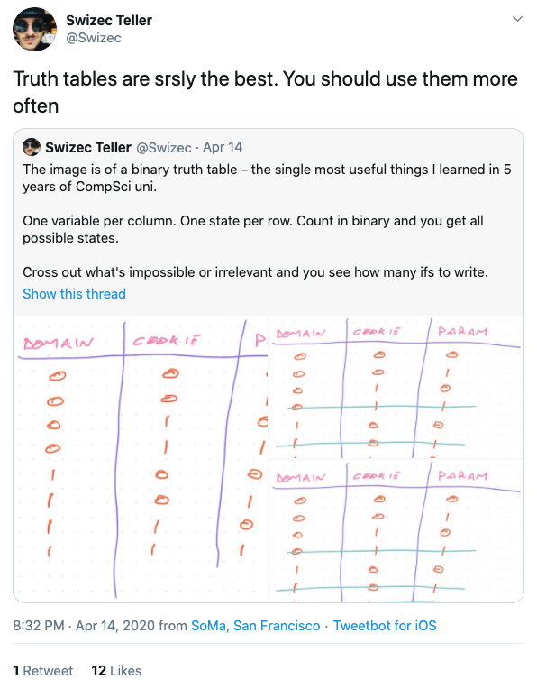

👋 Hello! This page might help you if you're deciding on doing a degree in computing, especially if you're considering Imperial College. You might be a student about to start a [Computing Science Masters at Imperial](https://www.imperial.ac.uk/study/pg/computing/computing-science/), the same course I'm doing right now.

I'm documenting what I learnt and the people that taught/ challenged me, and also reflect on my decisions so far. I've just finished all exams for this degree, and so am concluding the 'taught' part of the course. Onwards, to the individual project!

<!--truncate-->

## Courses I loved

I reserve this spot for courses with both amazing lecturers & content. Its no surprise all 3 lecturers below have been at Imperial for many years.

- **C++ by Professor Will Knottenbelt & Dr Fidelis Perkonigg:** these lecturers did not just teach C++, but also debugging, problem solving, communication, hard work and grit! The most valuable part of the degree. Dr Perkonigg is there with you in the computer labs, and students (including me) cannot get enough of him. **Note:** You get what you put in though. His guidance will be more valuable if you put more effort in programming yourself.
- **Operating Systems by Dr Anandha Gopalan:** These lectures are interesting and Anandha puts them into context for beginners. Useful algorithms and concepts that show up here, repeatedly came up at developer events I attended and technical videos online: a few months ago, I would've closed that tab. Now, I smile and think of Anandha. Anandha also edited his lecture recordings to make them more convenient to students during revision. He knows the struggle.
- **Logic by Dr Fariba Sadri:** This course made my brain think in weird & interesting ways. I intellectually enjoyed the course, and hope it will come in useful in the future. I've gained confidence in tackling weird looking things in the future. And... truth tables ARE used in industry! However, lectures aren't recorded for Logic. I'll never know what happened in that one lecture I missed. There are weekly sessions for practicing the logic questions. If you want to do [Prolog](https://en.wikipedia.org/wiki/Prolog), that can be done optionally.
  
- **Group project supervised by Anandha Gopalan:** You can find more details about Foodprint [here](http://foodprint.orth.uk/).

## The other courses I did

> These were all definitely useful & interesting to attend the lectures for. Some are required, and some are optional.

- Machine Learning
- Computer Vision
- Object oriented programming (OOP)
- Network & Web Security: I wish the tutorials weren't run in VMs.
- Computer Architecture
- Networks & Distributed systems (course is split in 2: Networks makes me 😻; Distributed systems part makes me 😕 because it is extremely outdated in comparison with the [equivalent course](https://www.youtube.com/channel/UC_7WrbZTCODu1o_kfUMq88g) at MIT).
- 🥺 Algorithms: way too theoretical, it did not include any popular algorithms, and did barely any implementation.

## The other courses

There are more courses shown [here](https://www.imperial.ac.uk/computing/current-students/pg-info/mcs/). For me, the available optional courses were:

> Systems Verification, Logic-Based Learning, Computer Vision, Graphics, Network and Web Security, Performance Engineering, Introduction to Machine Learning, Advanced Computer Graphics, Probabilistic Inference, Computer Networks and Distributed Systems, Introduction to Symbolic Artificial Intelligence (MSc), Software Engineering, Algorithms

## Courses I wish I could do

> There still is time. To the interwebs! I have the fundamentals now. I can learn anything with time & tea.

- Rust
- Concurrency programming
- Distributed Algorithms
- Performance engineering
- More operating systems
- Compilers
