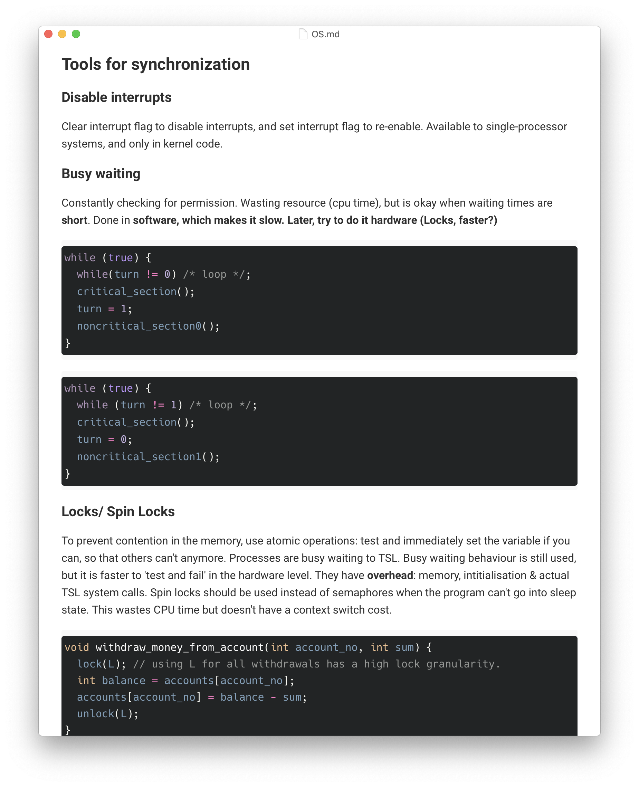
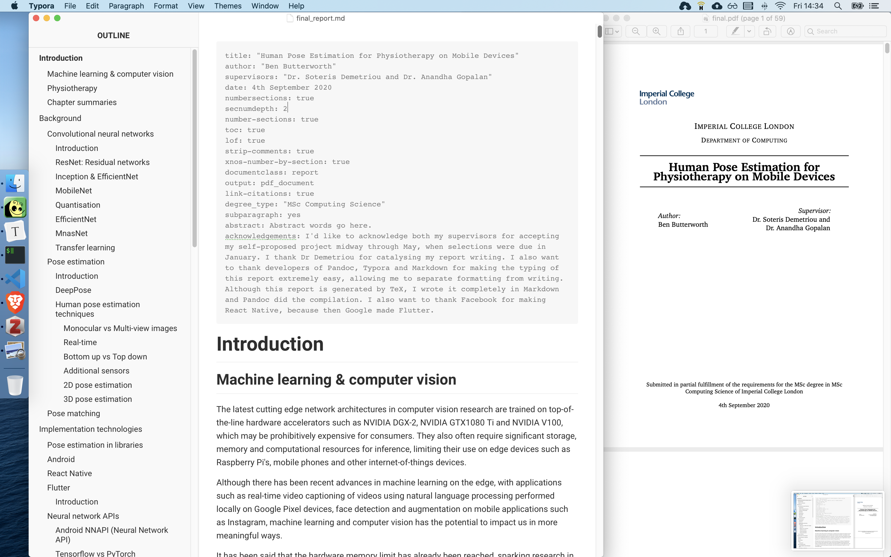
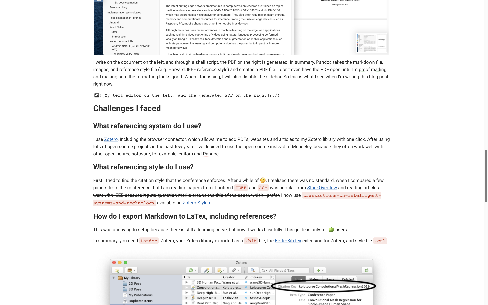
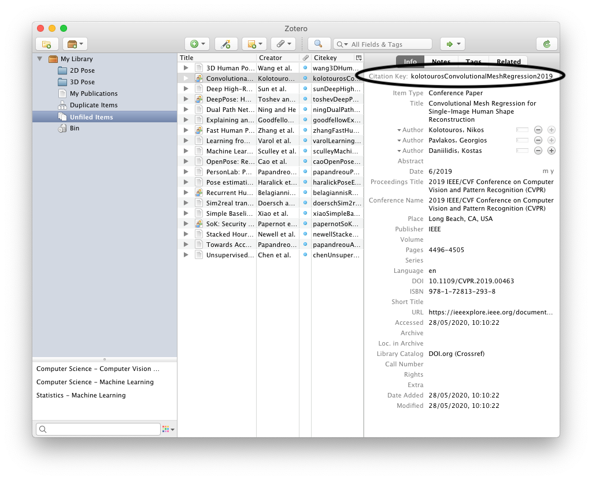
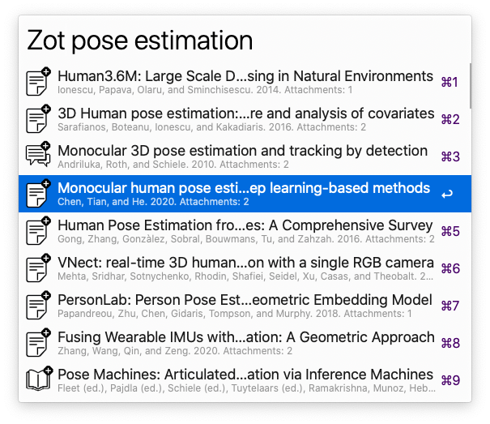

Read this if you think LaTex is too complicated, and you want to focus on writing content instead of formatting your the LaTex document.

<!--truncate-->

# Markdown `.md`

Markdown is a standard text format that many text editors support. It's actually the format that README files use in repositories websites, like GitHub and GitLab. I use Markdown to write notes (revision notes for courses at Imperial, notes about books/ articles I read), and project work, including my Master's thesis, because it can generate LaTex documents. Below is a screenshot of what it looks like when I'm writing my notes in Typora.



> When I'm thinking about LaTex or Overleaf syntax, I'm **not** thinking about the content. In I don't want to think about back-ticks to get quotation marks correctly, copying references into a `.bib` file, and other tedious tasks I don't want to force out from the depths of my slender Hippocampus.

## Benefits

- _Easy to move to a different editor_ when an editor becomes unpopular or a new editor is released with more features. Because Markdown is standard format, you can easily switch editors.
  - Notion and OneNote are popular, but there are issues with it. What happens when the Notion app ceases to exist, or its subscription fee is increased, or a better app gets created? You might lose all your documents, manually copy all your notes over, or be forced to pay a higher price.
- _Many beautiful editors available_. I use [Typora](https://typora.io/) because it has the cleanest UI which lets you focus on thinking about what you're writing, but [Zettlr](https://zettlr.com/) is also good. Compare this to installing the huge applications like LaTex or Microsoft Word. I've tried [Overleaf](http://overleaf.com/), but this is a paid software that has reportedly had inconvenient downtime before a deadline, according to a lecturer at Imperial College.
  - For example, putting quotes around a word requires you ``word"`. Start with a backtick and end with a double or single quote. That is extremely weird.
  - Uploading files to Overleaf is tedious: you need to upload the file manually, and then write an LaTex figure which uses that image. It takes at least a minute, if you're good! It's not the time, its the context switching cost. With a Typora plugin it takes one drag of the mouse. Dragging an image into Typora will upload it to online storage that you configure. I have it storing images to Imgur, you can set it to store to AWS S3 and more. You'll need the UPic plugin for Typora though.
- Widely used: A few blogging systems use Mardown or MDX (Markdown + JSX) for blog articles. JSX is the a markup language for React which looks similar to html. I'm using MDX for this blog. If I want to publish something I was writing in Typora, I just paste it into my blog `.mdx` file, set the publish date, and `npm run build`. I can also add some ReactJS components too.

## Drawbacks

- Syncing and collaboration: It would be great to collaborate on Markdown with others. And I still can't edit Markdown on Mobile, there doesn't seem to an application that can open sync . I might try to build a cloud service for Markdown files, with collaboration + mobile app 🙂.

# LaTex

If I'm writing a real report with references, equation and Figure numbers/ captions, then I use something called Pandoc (a CLI tool & library) to generate the nicely formatted LaTex output without touching LaTex. The entire LaTex ecosystem is complicated. I don't want to think about formatting or even see the formatting when I'm reading research papers and writing content. It breaks my train of thought. There is still a learning curve with using Pandoc. The benefit is that you can write in peace, and worry about formatting much less.



I write on the document on the left, and through a shell script, the PDF on the right is generated. In summary, Pandoc takes the markdown file, images, and reference style file (e.g. Harvard, IEEE reference style) and creates a PDF file. I don't even have the PDF open until I'm proof reading and making sure the formatting looks good. When I focussing, I will also disable the sidebar. So this is what I see when I'm writing this blog post right now.



## Challenges I faced & a guide for others

### What referencing system do I use?

I use [Zotero](https://www.zotero.org/), including the browser connector, which allows me to add PDFs, websites and articles to my Zotero library with one click. After using lots of open source projects in the past few years, I've decided to use the open source instead of Mendeley, because they often work well with other open source software, for example, editors and Pandoc.

### What referencing style do I use?

First I tried to find the citation style that the conference enforces. After a while of 🤔, I realised there was no standard, when I compared a few papers from the conference that I am reading papers from. I noticed `IEEE` and `ACM` was popular from [StackOverflow](https://academia.stackexchange.com/questions/41959/is-there-a-preferred-citation-style-for-computer-science-papers) and reading articles. ~~I went with IEEE because it puts quotation marks around the title of the paper, which I prefer.~~ I now use `transactions-on-intelligent-systems-and-technology` available on [Zotero Styles](https://www.zotero.org/styles?q=transactions-on-intelligent-systems-and-technology).

### How do I export Markdown to LaTex, including references?

This was annoying to setup because there's a learning curve, but now it works blissfully. This guide is only for 🍏 users (Windows/ Linux users need to find an alternative to Typora). In summary, you need `Pandoc`, Zotero, your Zotero library exported as a `.bib` file, the [BetterBibTex](https://retorque.re/zotero-better-bibtex/) extension for Zotero, and style file `.csl`.

1. Install [Zotero](https://www.zotero.org/) (reference manager)
2. Install the [Zotero connector](https://chrome.google.com/webstore/detail/zotero-connector/ekhagklcjbdpajgpjgmbionohlpdbjgc) extension in your browser, to add documents to your Zotero library easily, but also install Zotero things like style files
3. Create a folder where your report will live such as images and the markdown file
4. Export your Zotero library (remember the path/ directory to this, because you'll need it when generating the PDF with Pandoc, specifically the `--bibliography`). (File → Export → Better BibTex) your Zotero library somewhere, into the `.bib` file.
5. To get the citations formatted the way I wanted it, I had to install a new style I liked and that matches the conferences I am reading from to Zotero. I used [Zotero Style Repository](https://www.zotero.org/styles) to find the correct style. You could try searching for `IEEE` or `ACM`, and either install it to Zotero or download the `.csl` file. If you installed it to Zotero, you need to export the style from Zotero into a folder somewhere, for Pandoc to use it.
6. Install the [BetterBibTex](https://retorque.re/zotero-better-bibtex/) extension for Zotero
7. Get the referencing style you want to be used on your document.
8. Install [Pandoc](https://pandoc.org/installing.html)
9. Install a markdown editor, I suggest Typora
10. Write your content!
    - In your markdown file, all you need to do is use the `Citation Key`, which is provided in Zotero. Every time you want to add a reference in your document, just use `[@citationKey]`, for example `Kolotouros et al. mentioned blah blah blah [@kolotourosConvolutionMeshRegression2019]`. You can shorten the citation key in the Zotero settings, and I have done that now, so it looks like `[@kolotouros2019]` instead.
11. Generate your PDF using this command. Remember to change the paths to match the files you exported/ downloaded previously.

```bash
pandoc --filter pandoc-citeproc "report.md" --bibliography /Users/user/ZoteroLibrary.bib --csl /Users/user/ieee.csl -o "report.pdf"
open -a preview "report.pdf" # This will open the PDF with macOS Preview everytime you run the script
```



12. Repeat the previous 2 steps as many times as you want. To have links in the PDF, to link from the reference in your text to the bibliography section, you should add a `.YAML` section to the top of your markdown file. So now when you click the reference it will jump to the references section. I also added the command I used to generate the PDF so I don't have to save it somewhere else.

```---
link-citations: true
# More useful YAML attributes:
numbersections: true
secnumdepth: 2
number-sections: true
toc: true
lof: true
strip-comments: true
xnos-number-by-section: true
documentclass: report
---
```

### How do I reference figure numbers in the text?

This is helpful if you don't want to manually update figure numbers them in caption and all the references in your text, every time a new image gets added before it. StackOverflow is your friend. [This question/ answer](https://stackoverflow.com/questions/9434536/how-do-i-make-a-reference-to-a-figure-in-markdown-using-pandoc) shows you. However, you'll soon find out that figures are not numbered per section, and are just ascending from 1, 2, 3 and onwards. It would be nicer to have **Figure 1.1.3** instead of **Figure 24**. To fix this, you can use a Pandoc extension called [Pandoc Fignos](https://github.com/tomduck/pandoc-fignos), by [Thomas Duck](https://github.com/tomduck) on GitHub. There is a similar Pandoc extension, called [Pandoc Eqnos](https://github.com/tomduck/pandoc-eqnos), by [Thomas Duck](https://github.com/tomduck) on GitHub.

### How do I actually customise the LaTex output?

Give Pandoc a custom theme (a `.tex` file), and it will generate the report using that theme instead of the default LaTex layout. This allows for separation of concerns (a software engineering term, aka. SoC): you can create your own custom looking LaTex files to follow a standard template someone has given you, but you don't have to even look this complex file when trying to work on the content of the report. Pandoc's documentation on theming will come in handy as you explore this topic. It can get complicated. Your LaTex file has access to all the YAML attributes at the top of the markdown file. For example, my theme uses a special front page, so I use a `title: "This is the tile of my report"` in my YAML, and the theme can these use this in the LaTex file, with `$title$`.

For Imperial College computing, students are required to use LaTex and are recommended to use a college-provided theme for many of their projects. I have modified the theme Imperial provided us with to work with Pandoc, and it is available on [GitHub](https://github.com/ben-xD/ImperialCollegeLatexTheme). There is a starter report you can use, so just set up the environment following the guide above, and don't worry about LaTex or Overleaf.

### Cool plugins for Typora

**UPic** is a plugin that allows you to upload images to the internet purely by dragging images into the Editor. This means you don't have to worry about file directories. For example, once you have an image you like, just drag it into Typora and it will be uploaded to your online account on Imgur. UPic requires configuration to know which account to upload, so follow the documentation for this. UPic allows you to upload to Imgur, AWS S3 buckets, and more.

Alfred: Alfred is a replacement for spotlight on macOS. Its a free software but the paid version has a lot more functionality. With the paid version, if I want to find a reference or a citation key in Zotero, `zot ResearchPaper` will do that that for me.



## More documentation

- [Pandoc's](https://pandoc.org/MANUAL.html) manual is very helpful

## fin

I hope you've learnt something, and that your life is not consumed by LaTex, but by your research instead. I was worried about LaTex formatting a few months ago, but I'm happy to say I won't be worrying ever again.

 on Unsplash.](./heli.png)
Original photo by [Neil Thomas](https://unsplash.com/@neilmarkthomas?utm_source=unsplash&utm_medium=referral&utm_content=creditCopyText) on Unsplash.
