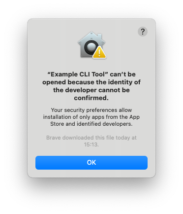
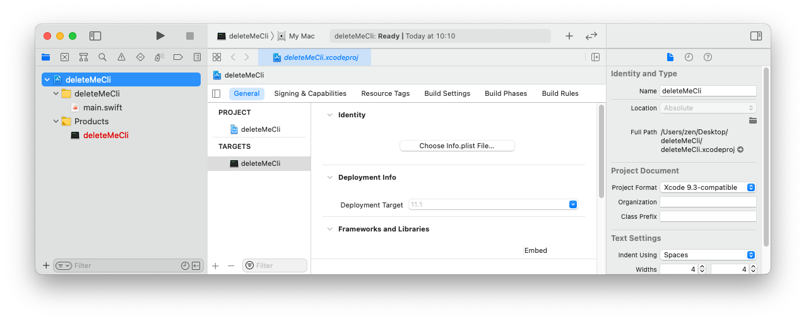
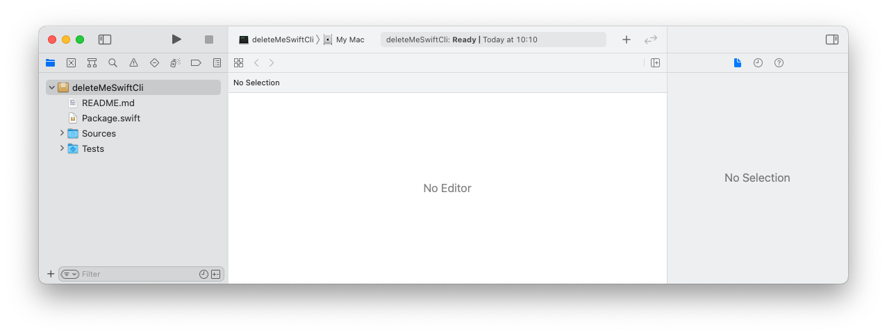
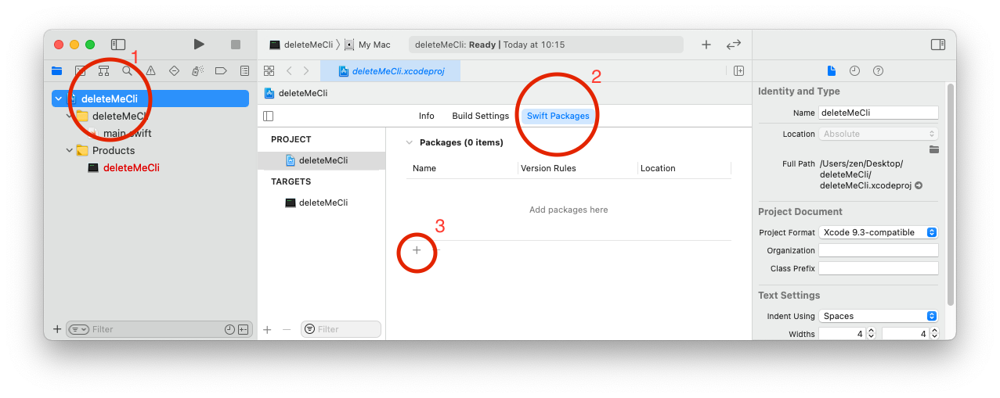
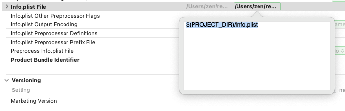

Once you've built your CLI tool and you're happy with the functionality, you want to share it with others. This is called _distribution_. You'll need the Apple Developer Program membership (`$99`) to perform _"Software distribution outside the Mac App Store"_ as per [Apple](https://developer.apple.com/support/compare-memberships/). This post goes over making a CLI tool in Xcode, including Building, Signing and Notarizing, on macOS Big Sur.

When users download your app from outside the App Store, macOS (GateKeeper) adds an attribute to the file (the Quarantine flag). When users try to launch the downloaded application (or cli tool), GateKeeper checks that the files meet certain requirements, and either allows the user to launch the app, or restrict the launch and shows the following UI instead:

<!--truncate-->



When running in the terminal, you'll get:

```zsh
> ./Example\ CLI\ Tool
zsh: permission denied: ./Example CLI Tool
```

> That's not a great user experience.

**Tip:** `Right click > Open` to bypass GateKeeper app to launch the app anyway, unfortunately we can't expect users to do this, so thats why we **notarize** our app. You can check this quarantine flag in the terminal using the `xattr` (extended attribute CLI) tool:

```zsh
> xattr -p com.apple.quarantine Example\ CLI\ Tool
0081;605f4bb1;Brave;39D0D1E9-5786-4D0E-9773-9EDB45F08C69
```

The above output states the flag is `0081`, the date is `605f4bb1` which translates to `GMT: Saturday, 27 March 2021 15:13:53` and is displayed on the UI alert, it was downloaded using the [Brave browser](https://brave.com/) and has a specific UUID. You can convert that Hex date into a human readable one using [EpochConverter](https://www.epochconverter.com/hex).

These requirements for a successful launch ~~are~~ seem to be:

- Application installers (.`pkg`) and their binaries (inside the .pkg) need to be **signed** by the developer team to ensure they come from a specific developer team and not just created by some random person pretending to be. You sign things with certificates, not a pen.
- Applications files (e.g. installers, apps) need to be **notarized by Apple** to ensure they are trusted. This process involves uploading it to the server through your developer account. The binaries (inside the .pkg) don't need to be.
- Applications need to have the **hardened capability** (this is a flag set on the built executable), which limits the access of the executable, which guarantees that the application doesn't have access to certain things without permission. On Xcode, this is an opt-in feature (capability) as opposed to opt-out.
- **Info.plist must be present with the executable,** either in a parent directory or embedded in the executable. Just having notarization and signed apps will not prevent your app from being quarantined by GateKeeper. If your installer places a folder in the users machine, then you can just put the Info.plist in that folder. However, in this project, we currently just place 1 file in the user machine, in `/usr/local/bin` so there is no place to put the Info.plist. We can embed `Info.plist` inside the executable instead, done through Xcode project settings.
  - **Note for future development:** If going to make the installer install a **directory** on the users machine, you'll need to add a symbolic/ soft link in `/usr/local/bin` pointing to executables in your directory. Otherwise the user won't be able to use it from their terminal since the executables aren't in the path.

## XCode vs. Swift Package ❌

There are 2 proper ways of creating a CLI tool for macOS. I prefer using a **Xcode project** because of the extra GUI features, all those Project settings tabs: `General`, `Signing and Capabilities`, `Build Settings`, `Build Phases` and more. You get `No Editor` in a _Swift package_ in Xcode. Some trade-offs:

1. **Xcode project**. Xcode can be helpful in learning and understanding the steps in the entire process, as opposed to typing everything in the terminal. Unfortunately, an Xcode project doesn't build very well with `xcodebuild clean build`, so you'll need to use Xcode for building the application.

   - _`xcodebuild` doesn't build Xcode projects very well? What's it for then??_ I don't know, I've tried to build a few applications using `xcodebuild` and either I don't know how to use it, or its an extremely neglected tool lacking in documentation.

   

1. **Swift package:** If we use the swift CLI to create a swift package. We won't do this, but these are the getting started steps:`mkdir projectName`, then `cd projectName`, then `swift package init --type executable`, then double click `package.swift` (Open it with Xcode). This is nice in that the folder is more organised, e.g. it has `Sources/` and `Tests/`. I needed to restart Xcode because no files were showing up. This does work well with `swift build`, so building the package is easy on the mac terminal. Unfortunately, Xcode is much less helpful.



## Create Xcode project 👷‍♀️

Use Xcode > File > New > Project... > macOS > Command Line Tool template to create an Xcode project.

## Swift Tools Support

_What's Swift Tools Support?_ In the readme, it says "Contains common infrastructural code for both [SwiftPM](https://github.com/apple/swift-package-manager) and [llbuild](https://github.com/apple/swift-llbuild).", however I prefer Federico Zanetello's description of it:

> these modules offer powerful abstractions for common [CLI related] operations.

## Add Swift Tools Support



- In the search bar (package repository URL), add the github URL: https://github.com/apple/swift-tools-support-core

- In the next window, leave them to the default `Rules`/ settings, press Next

- Pick `SwiftToolsSupport-auto`, this is important for the binary since we want a `Library`, not a `non Dynamic library`. This allows the binary to be standalone, without needing extra files.

  - 

  - Optional: _What's this dynamic and static linking?_

    - If you look in `SwiftToolsSupport`'s `package.swift`, you'll see these _package products_ described. The difference between `-auto` and without, `SwiftToolsSupport` has `type = .dynamic`, which means this dependency will be dynamically linked. `-auto` means let the swift compiler decide what to do: it conveniently chooses the static linking, we want this. Find more [here](https://docs.swift.org/package-manager/PackageDescription/PackageDescription.html). You can change this later in the project settings.

    - ```
          .library(
              name: "SwiftToolsSupport",
              type: .dynamic,
              targets: ["TSCBasic", "TSCUtility"]),
          .library(
              name: "SwiftToolsSupport-auto",
            targets: ["TSCBasic", "TSCUtility"]),
      ```

    - In static linking, all code, including shared libraries are bundled in your executable, when dynamically linked, they have to be added (linked) at runtime. I'll prefer static linking because I want my compiled CLI tool to be standalone, even though it might make the binary bigger.
    - Stack Overflow question: [Static linking vs dynamic linking](https://stackoverflow.com/questions/1993390/static-linking-vs-dynamic-linking)

  - And also try `man dyld` in the terminal to get the man page for the macOS dynamic linker.

    ```
    /// A library's product can either be statically or dynamically linked. It
    /// is recommended to not declare the type of library explicitly to let the
    /// Swift Package Manager choose between static or dynamic linking depending
    /// on the consumer of the package.

    taken from https://docs.swift.org/package-manager/PackageDescription/PackageDescription.html
    ```

- Now that you've added the repo, you can expand the dropdown menu in the file list (Project Navigator) and read the `package.swift` file for yourself. I recommend cross referencing with `PackageDescription` [docs](https://docs.swift.org/package-manager/PackageDescription/PackageDescription.html).

## ⌨️🎨 Write some code 🚀🌈

Federico's post has a great section called "Common Patterns" [here](https://www.fivestars.blog/code/ultimate-guide-swift-executables.html), including exit codes, system modules, launch arguments, iterative scripts, environment variables, pipeline messages, async calls, input parsing, and progress animations. Please have a read there, to make your CLI tool conform to expected CLI practices.

## Signing and Notarization ✍️

### Set up your machine/ Xcode

#### Generate Developer ID certificates

You need the **account holder** of the **Apple developer team** to create 2 certificates for you, `Developer ID Installer` and `Developer ID Application`.

- What is a Developer ID certificate?: They are certificates for **distribution (not developers...)** to identify themselves (sign their products) for delivery outside the App Store. More info [here](https://help.apple.com/developer-account/#/dev04fd06d56). This is distinct to _Development Certificate_. There are 2 types:
  - You need the `Developer ID Application` certificate to sign the application/ executable
  - You need the `Developer ID Installer` certificate to sign the installer
  - One Apple account (e.g. An account which costs \$100/year) can create a maximum of 5 Developer ID installer certificates and 5 Developer ID application certificates. Personally, I would have named them _Distribution_ ID, not Developer ID. To summarize, all developers get a _Development Certificate_, but there's no way all developers get a _Developer ID certificate_.
- Create the certificate, account holders usually already know how to do this on either [Xcode Guide](https://help.apple.com/xcode/mac/current/#/dev154b28f09) or [developer.apple.com Guide](https://help.apple.com/developer-account/#/dev04fd06d56)

#### Add certificate to keychain

Double-click/ open the 2 files provided by the account holder. They've had to password protect the certificate when they generated it, so you'll need it to unlock this file. This password is not needed anymore once its in the keychain. You can delete the downloaded file they gave you too.

### Configure the Xcode project for release

- **Embed `Info.plist:`** You need Info.plist embedded in the executable. In the target or project `Build Settings`,

  - Search for `Info.plist`, and you'll see `Create Info.plist Section in Binary`. Set this to `Yes`.

  - Then, create an `Info.plist` somewhere in your project (I recommend the root of the project) which has at least 3 items, `CFBundleIdentifier`, `CFBundleName`, and `CFBundleShortVersionString`. I took this requirement from [Howard Oakley's blog post](https://eclecticlight.co/2019/06/13/building-and-delivering-command-tools-for-catalina/):

    ```
    <?xml version="1.0" encoding="UTF-8"?>
    <!DOCTYPE plist PUBLIC "-//Apple//DTD PLIST 1.0//EN" "http://www.apple.com/DTDs/PropertyList-1.0.dtd">
    <plist version="1.0">
    <dict>
    	<key>CFBundleIdentifier</key>
    	<string>com.example.example-cli-tool</string>
    	<key>CFBundleName</key>
    	<string>Example CLI Tool</string>
    	<key>CFBundleShortVersionString</key>
    	<string>1</string>
    </dict>
    </plist>
    ```

    - Howard called them `Bundle Identifier`, `Bundle Name` and `Bundle version string (short)`. Those are the human readable strings which Xcode shows you when it sees the "raw strings" in the `.plist` file. Which is actually just an `.xml` file. Nothing special.

  - Set `Info.plist` File to the path, for example `$(PROJECT_DIR)/Info.plist` if you placed this in the project root directory. Xcode will convert this into its absolute path in the UI, you don't write the absolute path yourself.

    

- **Signing configuration:** In `Signing and Capabilities`

  - Don't 'automatically manage signing'. Uncheck this.
  - Set the correct team (your team)
  - Update the correct bundle identifier

- **Hardened Runtime:** In `Signing & Capabilities`, Click `+ Capability` and select **Hardened Runtime**. Leave it to default settings.

### Create an Archive

- Click `XCode menubar` > `Product` > `Archive`. Wait for the archive to complete, and the `Organizer` will open. You can also open it with `Xcode menubar` > `Window` > `Organizer` > `Archives`
- Click `Distribute Content` > `Built Products` > Export it as a `build` folder.

#### Quick check: Is your executable signed?

**Make sure executable was signed:** `codesign -dv --verbose=4 "build/Products/usr/local/bin/Example Cli Tool"`

### Build package/ installer

```
pkgbuild --root build/Products \
           --identifier "com.example.example-cli-tool" \
           --version "1.0" \
           --install-location "/" \
           --sign "Developer ID Installer: Team Name (Team ID)" \
           "Example CLI Tool.pkg"
```

- The `--root` folder needs to have the files arranged in the way you want it to be installed on your users device.
- Notice the install location is `/`. This is because `/usr/local/bin` is already set as an Installation Directory in the Xcode project. If we did them in both places, you'll get `/usr/local/bin/usr/local/bin/ROOT_DIRECTORY_CONTENTS`.
- The `--sign` value (i.e. `"Developer ID Installer: Team Name (Team ID)"`) can be found in `Keychain.app`: but look specifically for the certificate with **Installer**, which you should've created (or the account holder gave you).
- You can rust _pre-_ and _post-_ install scripts if you use `--scripts build/Scripts`. Read `man pkgbuild` for more details. This is not necessary for the most basic app, since we bundle all files needed into this one binary, and it sits inside `/usr/local/bin`, which is already on your macOS `PATH`.
- **Alternative: Build package/ installer: use [Packages](http://s.sudre.free.fr/Software/Packages/about.html)**
  - Using the [Packages](http://s.sudre.free.fr/Software/Packages/about.html) app, we can configure the destination of each file in our program through a GUI. We might want to put some files in `/usr/local/bin`, a directory in `/usr/local`, etc. It also has a CLI, but if we can get away with not using third party app, we should.
  - Then sign the `.pkg` file: `productsign --sign "Developer ID Installer: Team Name (Team ID)" "Example CLI Tool.pkg" "~/Desktop/Signed-Example CLI Tool.pkg"`

### Quick Tests

**Make sure installer works:** Lets see the installer does its job, before playing around with GateKeeper and Notarization. Run the `.pkg` file generated. You should be able to run `` from any directory. You'll need a fresh terminal (restart it).

**Notarization hasn't completed:** I've got three ways to check:

- ```
  > spctl --assess -vvv --type install "Example CLI Tool.pkg"
  Example CLI Tool.pkg: accepted
  source=Notarized Developer ID
  origin=Developer ID Installer: Team Name (Team ID)
  ```

- ```
  > xcrun stapler validate "Example CLI Tool.pkg"
  Processing: Example CLI Tool.pkg
  Example CLI Tool.pkg does not have a ticket stapled to it.
  ```

- **My favorite:** Drag the `.pkg` file into a new browser window, and re-download it. Now try to open it, it should say: `“Example CLI Tool.pkg” can’t be opened because Apple cannot check it for malicious software.` Even the Apple don't know about this, they suggest one of 2 ways to trigger quarantine:

  - Email the app to yourself and use the copy that Mail downloads.
  - Host the app on your own local or remote server and use the copy that Safari downloads.

### Generate an app-specific password on Apple ID

- To notarize the app, we could use, for example: `xcrun altool --notarize-app ... --password "SENSITIVE_APPLE_ID_PASSWORD" ...`, but this reveals the password. Instead, we can add the password to the Apple keychain and refer to it as `xcrun altool --notarize-app ... --password "@keychain:ITEM_NAME" ...`.
- Create an app specific password on https://appleid.apple.com/ > Security > `APP-SPECIFIC PASSWORDS` > Click `Generate Password…`. Give it a label that makes sense to you, e.g. `MacBook Pro 16"` or `Mac M1 Mini`. This name is just for labelling it in your Apple ID account. You might want to revoke in the future when you're not using that password anymore.
- Open `Keychain.app`
- Click File > New Password Item
  - **Keychain Item Name:** `Apple ID` (or any name you prefer). You'll refer to this password item with e.g. `@keychain:Apple ID`.
  - **Account Name:** `$APPLE_ID_EMAIL`, set this to your **Apple ID email**.
  - **Password:** The app password generated from https://appleid.apple.com/ mentioned before.
- Note: If editing an existing password item, its the `Where` field which matters, not the `Name` field.

### Notarize package

- To notarize the installer (`.pkg`). [A previous](https://eclecticlight.co/2019/06/13/building-and-delivering-command-tools-for-catalina/) blog post mentioned that you need a **Developer ID Distribution signature** but this is not necessary.

```
xcrun altool --notarize-app \
             --primary-bundle-id "com.example.example-cli-tool" \
             --username "apple_id_email@your_domain.com" \
             --password "@keychain:Apple ID" \
             --asc-provider "APPLE_TEAM_ID" \
             --file "Example CLI Tool.pkg"
```

- _Where do I get `asc-provider` value?_ It's the team ID you're in, you can find it in the developer.apple.com website, or on your certificate, or run the following command: `xcrun altool --list-providers --password "@keychain:Apple ID" --username "apple_id_email@your_domain.com"`
- Check for completion: Get your request uuid from the output of the above command. You have to wait until the status message is: `Status: success`, you get `Status message: Package Approved`. You also get an email about the success. I am pretty sure you need to get the success response before you try doing the below stapling step.

```
REQUEST_ID=SET_YOUR_REQUEST_ID_HERE
xcrun altool --notarization-info "$REQUEST_ID" \
             --username "apple_id_email@your_domain.com" \
             --password "@keychain:Apple ID"
```

- Staple the notarization ticket to the pkg file with `xcrun stapler staple "Example CLI Tool.pkg"`
- **Quick tests:** You can **verify** Notarization ticket was stapled onto your installer or executable:
  - `xcrun stapler validate example_cli.pkg`
  - or `spctl --assess -vvv --type install example_cli.pkg`

## Release

You can distribute this app through Github, your personal website or other places. Users will enjoy the lack of GateKeeper UIs.

## Other resources

Have a read of these resources for more context:

- [Building and delivering command tools for Catalina](https://eclecticlight.co/2019/06/13/building-and-delivering-command-tools-for-catalina/) was useful in that it mentioned `Info.plist` was a requirement, and demonstarted that CLI tools can be build through Xcode. However, it uses the `Packages.app` application instead of using the command line. My post will show both ways: using Xcode with First-party CLI tools, and also briefly on `Packages.app`

- I found ["notarize a command line tool"](https://scriptingosx.com/2019/09/notarize-a-command-line-tool/) very useful, but unfortunately it creates a swift package instead of an Xcode project. Therefore, a lot of other Apple and Xcode guides are not relevant. You're in the dark if things go wrong, especially since swift package manager hasn't been around as long as Xcode. This article also goes to say certain things in Howard Oakley's post are not needed, but I disagree.

## Questions

Feel free to comment on this page, I'll get a notification about it and do my best to reply. I found working through notarization has been challenging and interesting, though I am not sure everyone will enjoy it.
