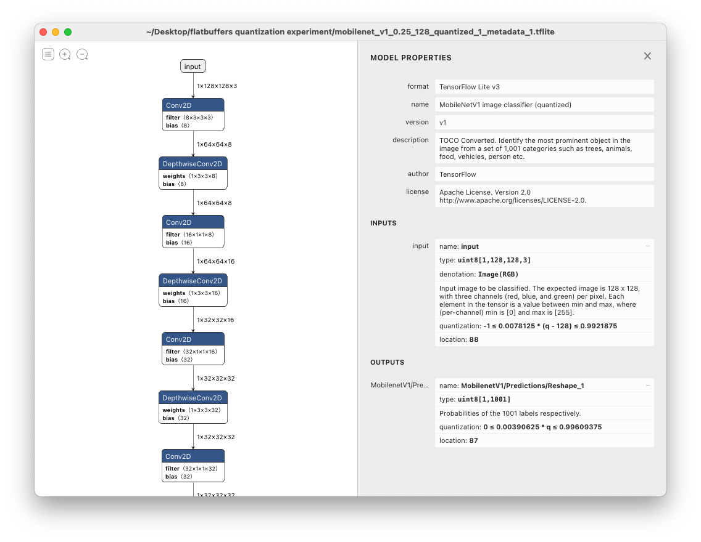

TensorFlow models are saved in the [protocol buffer](https://developers.google.com/protocol-buffers/) format, which is an efficient way of storing and transporting data. I first heard and used it when I worked at [Popsa](popsa.com) where we used them to speed network requests between mobile apps and the backend. I then realised TensorFlow also uses this format to store models, including the weights and metadata. Popsa had a github repo specifically used to design and agree upon the interface between the backend and the mobile applications. gRPC also uses protocol buffers as the format. [gRPC](https://grpc.io/) also uses protocol buffers as its format, by default. You can generate the classes to create, serialize and deserialize these objects in your preferred language with the protobuf compiler, `protoc`.

<!--truncate-->

Instead of protocol buffers, TensorFlow Lite uses [FlatBuffers](https://google.github.io/flatbuffers/). It has many of the benefits of protocol buffers, but without the cost of needing to deserialise the entire data file. In network requests, we don't pack that much information into a protocol buffer anyway, where a file might be 100KB. We can deserialise the entire data object very quickly. However, for ML model, we might store anywhere between 500KB to 1GB. For example, the [CenterNet Object and Keypoints detection model with the Hourglass backbone](https://tfhub.dev/tensorflow/centernet/hourglass_1024x1024_kpts/1) is ~695MB. It might be important to get some information out of the model without loading the entire model in memory.

I wanted to read the tensorflow lite model (flatbuffers) in Python without using TensorFlow lite. [There are easier ways to do this](#note-the-easier-path), but I wanted to use `flatc`!

### Getting `flatc`

We had `protoc` for protobufs, but I couldn't find the FlatBuffer equivalent, `flatc` anywhere. Unfortunately, the FlatBuffers repo doesn't provide an obvious way of getting the `flatc` binary so you can generate your class files. You can either download it from a CI job, or build it yourself.

- **Download it from CI:** Instead of building it, you can download it from most [CI jobs'](https://github.com/google/flatbuffers/actions) "Artifacts" section. For example, [here](https://github.com/google/flatbuffers/actions/runs/756817539), but this likely to be outdated for you.
- **Building it yourself:**
  - `git clone git@github.com:google/flatbuffers.git`
  - `cd flatbuffers`
  - `cmake -G "Xcode" -DCMAKE_BUILD_TYPE=Release`
  - Open the project with Xcode (`xed .`) and build it, or just run `xcodebuild clean build`: build all the binaries. Find the `flatc` binary and use it, or
  - **Optional:** Copy the generated binary into a directory which is already on path: `cp ./Debug/flatc /usr/local/bin`. This means you can use `flatc` anywhere

### Compiling TensorFlow Lite schema in Python

- Download the schema by visiting the following link, or running `wget https://github.com/tensorflow/tensorflow/blob/master/tensorflow/lite/schema/schema.fbs`. I found it by just [searching for it](https://duckduckgo.com/?q=tensorflow+lite+model+schema&atb=v263-1&ia=web&iai=r1-0&page=1&sexp=%7B%22cdrexp%22%3A%22b%22%2C%22biaexp%22%3A%22b%22%2C%22msvrtexp%22%3A%22b%22%7D).
- ``flatc --python schema.fbs `. Code is generated in a new directory:`tflite/`
- Create a python environment and install `flatbuffers` and `numpy`:
  - `python3 -m venv ./venv`
  - `. ./venv/bin/activate`
  - `pip install --upgrade flatbuffers numpy`
- Optional stretch goal for you: Can you modify the following script to

### Using the library

```python
import flatbuffers
# import numpy # Not used directly, but needed for AsNumpy function calls
from tflite.Model import Model

# Update the path to your model
model_path = "./mobilenet_v2_1.0_224_quantized_1_metadata_1.tflite"
with open(model_path, "rb") as model_file:
  buffer = model_file.read()

# Read output tensor
model = Model.GetRootAs(buffer)

print(dir(model))

print(model.Metadata(0).Name())

output_index = model.Subgraphs(0).Outputs(0)
output_tensor = model.Subgraphs(0).Tensors(output_index)
quantization = output_tensor.Quantization()

# read its quantizationParameters
print(f"Quantization: {quantization}")
q_min = quantization.MinAsNumpy()
q_max = quantization.MaxAsNumpy()
q_scale = quantization.ScaleAsNumpy()
q_zero_point = quantization.ZeroPointAsNumpy()
print(f"q_min: {q_min}")
print(f"q_max: {q_max}")
print(f"q_scale: {q_scale}")
print(f"q_zero_point: {q_zero_point}")
```

## An _easier_ path

There is an easier way to get the quantization parameters in Python. Just load the model, and read the input or output details. If quantization parameters are set, they will be in the dictionary.

So lets download a quantized model from tfhub.dev, called [mobilenet_v1_0.25_128_quantized](https://tfhub.dev/tensorflow/lite-model/mobilenet_v1_0.25_128_quantized/1/metadata/1)

Then lets prepare the python environment. TensorFlow now supports Python3.9, so this is easy.

- First, create a virtual environment in a directory called venv: `python3 -m venv ./venv`
- Load the environment: `. ./venv/bin/activate`
- Install tensorflow: `pip install tensorflow`
- run this script:

```python
import tensorflow as tf

interpreter = tf.lite.Interpreter(model_path=model_path)
input_details = interpreter.get_input_details()
output_details = interpreter.get_output_details()
```

## An _even_ easier path

Open it in [Netron](https://netron.app/), and the quantization parameters are right there:

The syntax is: `min <= scale * (q - zero_point) <= max`. I wrote more about the syntax on [StackOverflow](https://stackoverflow.com/a/67115490/7365866).



At least now, you know where they sit in the TensorFlow model file, which is actually flatbuffer file with a `.tflite` extension.
