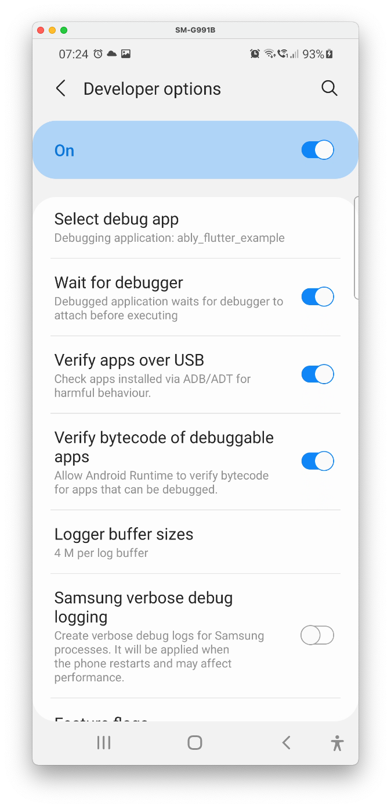
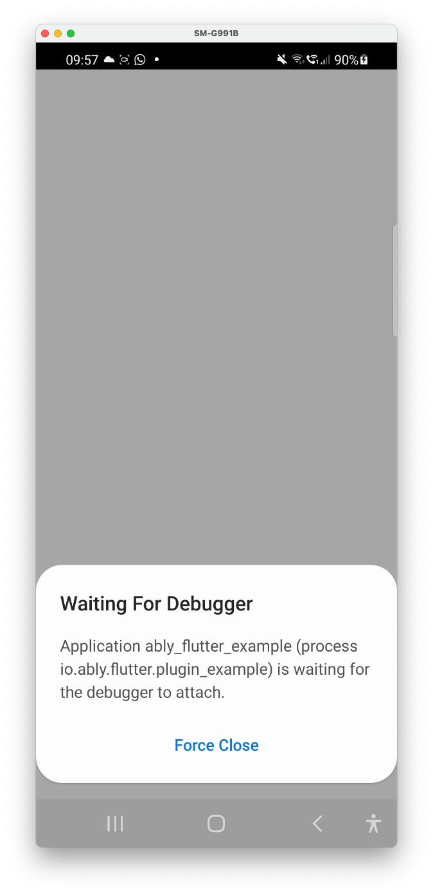
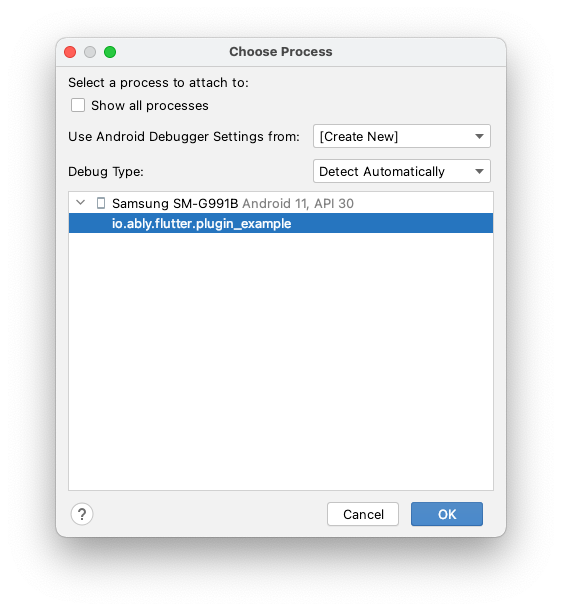

## Motivation

You may want to observe/ debug behaviour related to your app's Activity, Broadcast Receiver or Service being launched by an Intent, without any side effects of the application already running. For example, I was testing push notifications, and wanted to debug the case where **no other application components was running (Activity, Service)**, and only the Broadcast Receiver declared in my `AndroidManifest.xml` was launched in response to the push notification message. This is only possible if the application hasn't been launched yet by Android Studio.

The trick is prevent your app from launching until the debugger is attached, and then to attach the debugger. This means you won't miss anything between the app launching and you attaching the debugger.

<!--truncate-->

## Steps

- Ensure your app is installed
- Enable and configure **Developer options**. In **Developer options**, 
  - Enable **USB debugging**. This allows you t debug your apps, and to use adb to copy files,  check processes running on your device, etc.
  - Press **Select debug app**, and select your application.
  - Then enable **Wait for debugger**
  - You screen should look something like:
  - 
  - Optional: enable **Stay Awake**. This is nice to avoid your Android from locking while you are trying to run and test apps on your device. This could get annoying though, for example when you say "Ok Google", the screen will turn off but won't turn off, so you should remember to turn this off at the end of the day.

## Trigger your app to launch

If you are trying to test push notifications, send a push notification to your device. For example, I have an iOS application which can send a push notification to other devices. Your app should not actually launch, but it would be *waiting for the debugger*:

## Flutter only

If you are working on Flutter, you should have 2 Android Studio windows open:

- One window for the project (root project directory, `project_dir`)
- One window for the android project (`project_dir/android`, or for flutter package plugins, `project_dir/example/android`)

At this point, you should press **Flutter attach** in your `project_dir` Android Studio window first. Nothing will happen until after you attach your Android app debugger, below. You should currently only see, for example *"Waiting for a connection from Flutter on SM G991B..."*. **SM G991B** is my physical device, and Samsung S21.

## Attach your debugger

Click the **Attach debugger to Android Process**, and in the window, select your application by its application ID. Your application should launch, and your debugger breakpoints will work. If running Flutter, your Flutter debugger in Android Studio will also 

## Tips/ warnings

- 🐛 If **Wait for debugger** is enabled, sometimes you need to detach or close Android Studio's debugger and re-attach it if you want to handle a subsequent application launch successfully. Otherwise, the app would never launch. 

## Other nice tools

- [scrcpy](https://github.com/Genymobile/scrcpy): A great tool to show your Android screen on your computer.
- [pidcat](https://github.com/JakeWharton/pidcat): A logcat which is easier to read and use, maybe.