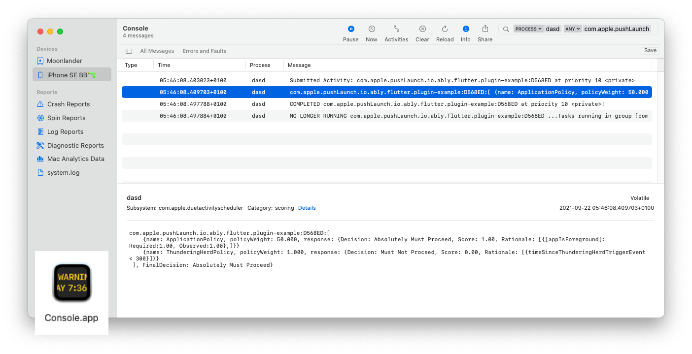

The real value/uniqueness on this page is showing how to use [Console.app for push notifications](#reading-device-logs). I also include some more basic guidance to help you avoid some common problems.

<!--truncate-->

## Use the debugger

Launch the application from Xcode (run, but ensure your scheme uses the **Debug** build configuration, not release or profile) or AppCode (debug mode). Place breakpoints in methods that should be called to confirm that your methods are (not) being called. Some useful methods:
- Alert notification: 
  - Note: If you send a message without `data`, you won't be able to handle the notification in `didReceiveRemoteNotification` below. Instead, you can handle notification taps by the user, and decide to even show it if the app is in the foreground.
  - Notification tap: [`didReceiveNotificationResponse:completionHandler:`](https://developer.apple.com/documentation/usernotificationsui/unnotificationcontentextension/1845197-didreceivenotificationresponse)
  - Foreground alert notifications: [`userNotificationCenter(_:willPresent:withCompletionHandler:)`](https://developer.apple.com/documentation/usernotifications/unusernotificationcenterdelegate/1649518-usernotificationcenter)
- Background notifications: [`application(_:didReceiveRemoteNotification:fetchCompletionHandler:)`](https://developer.apple.com/documentation/uikit/uiapplicationdelegate/1623013-application)
  - Don't use [`application(_:didReceiveRemoteNotification:)`](https://developer.apple.com/documentation/uikit/uiapplicationdelegate/1623117-application), the deprecated version.

## Request authorization from the user

If showing an alert notification to the user, be sure to [`requestAuthorization`](https://developer.apple.com/documentation/usernotifications/unusernotificationcenter/1649527-requestauthorization) to show notifications from the user. This is **not** required if you just want background messages, handling messages in [`didReceive(_:completionHandler:)`](https://developer.apple.com/documentation/usernotificationsui/unnotificationcontentextension/1845197-didreceivenotificationresponse). It's really easy to forget this.

## Try sending it directly to APNs

You should do this when first debugging. This allows you to test push notifications without having to structure a message correctly, since this file does it for you. This also reduces the complexity/ layers in the problem when first debugging, since 3rd party services ([Ably's Channels](https://ably.com/documentation/general/push/publish#channel-broadcast) or [Firebase Cloud Messaging](https://firebase.google.com/docs/cloud-messaging/)). If the device is registered correctly, it should receive this message. Make sure to update the `TEAMID`, `KEYID`, `SECRET`, `BUNDLEID` and `DEVICETOKEN`. My colleague shared this script with me:

**Usage:** Get `direct_apns.sh` from this [GitHub Gist](https://gist.github.com/ben-xD/14e4ab65d4e85faa9b6214e0f8f049af). Run `chmod +x direct_apns.sh` and execute it: `./direct_apns.sh`.

- If the script failed with an error, check the error which is returned by APNs. 
- If the script was successful but it doesn't appear to arrive on the device, time to read the logs. (See below)
- If this arrives on the device, but your own messages don't, this means you are not structuring your message correctly. For example, I've seen users who [set `apns-headers` in Firebase at the wrong level of the JSON](https://stackoverflow.com/a/69057098/7365866) being sent to Firebase.

## Reading device logs

Open **Console.app** (this is different to Terminal.app or iTerm2.app) installed on your mac. To confirm your application received the push message/ check for errors related to push notifications:



Be sure to start logging for the correct dvice. Then find relevant logs by:
- search for the following log messages:
  - Both failures and success: `com.apple.pushLaunch`
  - Failures only: `CANCELED: com.apple.pushLaunch`. For example, this may show the log line: `CANCELED: com.apple.pushLaunch.com.example.app:DBA43D at priority 10`
  - Success only:  `COMPLETED com.apple.pushLaunch`. For example, this may show the log line `COMPLETED com.apple.pushLaunch.package_name:XXXXXX at priority 5`
- filter for `dasd` process either by right clicking a log line with `dasd` and click `Show Process 'dasd'`.
- If you are sending a background notification, it may be throttled by iOS. In this case, an error will be shown in Console.app, but will eventually arrive to your application, where [`didReceiveRemoteNotification`](https://developer.apple.com/documentation/uikit/uiapplicationdelegate/1623013-application) delegate method will be called, often within a few minutes. If you look in the Console.app logs, you may find sending the exact same message gives different outcomes:
    - `ThunderingHerdPolicy` error ([What really is the `ThunderingHerdPolicy`?](https://stackoverflow.com/questions/68983220/ios-push-notifications-what-is-thunderingherdpolicy)): 
    ```bash
    {name: ThunderingHerdPolicy, policyWeight: 1.000, response: {Decision: Must Not Proceed, Score: 0.00, Rationale: [{deviceInUse == 1 AND timeSinceThunderingHerdTriggerEvent < 900}]}}
      ], FinalDecision: Must Not Proceed}
    ```
    - `cameraIsActive` error:
    ```bash
    com.apple.pushLaunch.io.ably.flutter.plugin-example:4935F4:[
    {name: MemoryPressurePolicy, policyWeight: 5.000, response: {Decision: Must Not Proceed, Score: 0.00, Rationale: [{cameraIsActive == 1}]}}
    ], FinalDecision: Must Not Proceed}
    ```
    - A successful delivery: 
    ```bash
    {name: ApplicationPolicy, policyWeight: 50.000, response: {Decision: Absolutely Must Proceed, Score: 1.00, Rationale: [{[appIsForeground]: Required:1.00, Observed:1.00},]}}
      ], FinalDecision: Absolutely Must Proceed}
    ```
    - Another successful delivery:
    ```bash
    com.apple.pushLaunch.io.ably.flutter.plugin-example:5E1C66:[
    {name: DeviceActivityPolicy, policyWeight: 5.000, response: {Decision: Can Proceed, Score: 0.25}}
    ] sumScores:93.270000, denominator:97.020000, FinalDecision: Can Proceed FinalScore: 0.961348}
    ```

I initially wrote this to add Push Notifications support to a Flutter library. There might be more useful content [there](https://github.com/ably/ably-flutter/blob/main/PushNotifications.md).

## A note about environments (APNs sandbox vs production)

There are 2 environments, sandbox and production.
- **Sandbox:** When running your application via Xcode or your machine (Android Studio, command line), your application runs in either debug, profile or release mode. In all cases, your application will use the sandbox/development APNs environment. Also, If distributing through Development, the sandbox / development APNs environment is used. 
- **Production:** When distributing your app in the App Store, Ad Hoc or through App Store Connect, it will always use the production environment. 

## More problems?

Comment below with your issues and I'll try to help. APNs can be quite a frustrating experience, and I understand it a bit deeply now, and I'm happy to help. Or ask a Stack Overflow question and link it below.