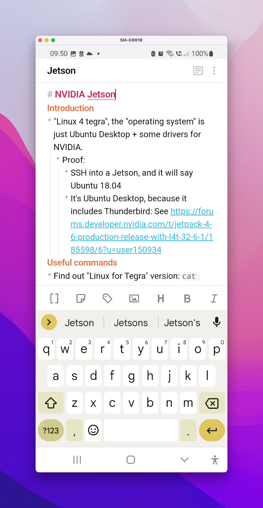
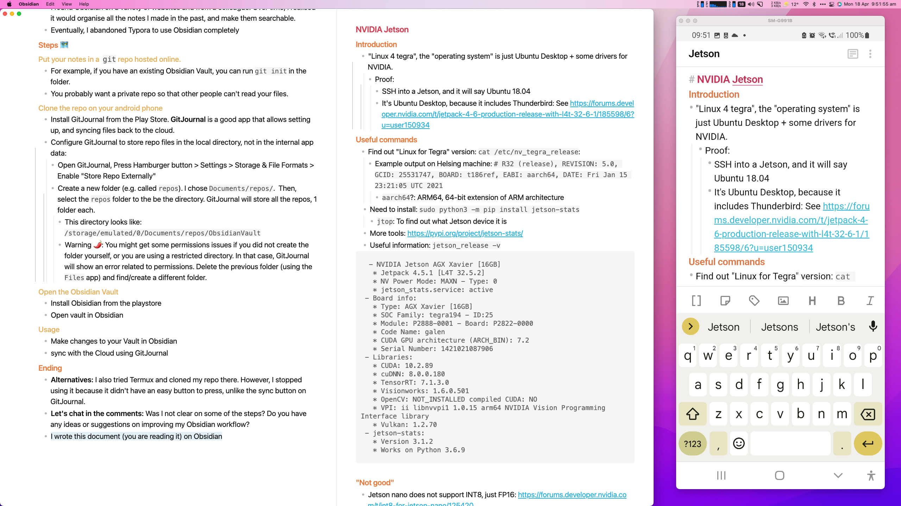

## Motivation 💪
- You have been using [Obsidian](https://obsidian.md/) to store your notes. I highly recommend it if you don't - in that case, come back to this page later.
- Your current solution to write notes is to use a separate app or separate Obsidian Vault on your phone. After you reach your computer, you manually copy and paste data into your primary Obsidian Vault. I previously used Google Keep for temporary notes, which were moved into Obsidian Vault when I found the time.

<!--truncate-->

## Warning 🌶
- This guide requires the use of **command line** and **git**, and storing your data *privately* online, like on GitHub. Therefore, it is not end-to-end encrypted, and Github developers could have access to your data.
- If you are unwilling, there are other ways to sync Obsidian Vaults, e.g. using Google Drive, Dropbox or paying for the Sync Service from Obsidian directly.
- If you want end-to-end encryption for your files, use the Obsidian Sync Add-On Service ([currently $8/mo](https://obsidian.md/pricing)).
## Brief notes about my note taking 📝
- [Markdown](https://www.markdownguide.org/) is an open file format to store your information, and it was created by [Aaron Swartz](https://en.wikipedia.org/wiki/Aaron_Swartz) and [John Gruber](https://en.wikipedia.org/wiki/John_Gruber). 
    - It's readable even in its raw format (text) without an app, eg (MS Word), but you can make it look even better with apps like Typora and Obsidian.
    - **Open file format:** This means if the app you're using shuts down, changes it's pricing or is unethical, you can take your data to another app without much cost.
- I started using Typora when it was free, and it was great. As they previously warned, it became paid software, and that is fair - it's a great app.
- I found Obsidian on a variety of websites and from a colleague. Over time, I realised it would organise all the notes I made in the past, and make them searchable.
- Eventually, I abandoned Typora to use Obsidian completely since I could do everything in Obsidian.

## Example 😃

Here's a picture of a file from my Obsidian Vault I wrote on macOS, but it's viewable and editable from Android. My Android device screen is captured using [scrcpy](https://github.com/Genymobile/scrcpy)

## Steps 🗺
### Put your notes in a  `git` repo hosted online. 🌎
- Basically, use Github, Gitlab or other cloud provider which hosts git repositories.
- You probably want a private repo so that other people can't read your files.
- Github has a guide for this: [Create a repo](https://docs.github.com/en/get-started/quickstart/create-a-repo)
### Clone the repo on your android phone 📲
- Install GitJournal from the Play Store. **GitJournal** is an app that allows cloning repos, and syncing files back to the cloud.
- Configure GitJournal to store repo files in the local directory, not in the internal app data:
    - Open GitJournal, Press Hamburger button > Settings > Storage & File Formats > Enable "Store Repo Externally"
    - Create a new folder (e.g. called `repos`). I chose `Documents/repos/`.  Then, select the `repos` folder to the be the directory. GitJournal will store all the repos, 1 folder each.
        - Some notes about paths:
            - GitJournal will show the true path for the directory (ie  `/storage/emulated/0/Documents`), whereas
            - the `Files` app only shows files inside of `/storage/emulated/0` as the root aka. Internal storage folder. 
        - **Warning 🌶:** You might get some permissions issues if you did not create the folder yourself, or you are using a restricted directory. In that case, GitJournal will show an error related to permissions. Delete the previous folder (using the `Files` app) and find/create a different folder.
### Open the Obsidian Vault 📖
- Install [Obisidian from the playstore](https://play.google.com/store/apps/details?id=md.obsidian)
- Open vault in Obsidian
### Usage 🔁
- Make changes to your Vault in Obsidian
- sync with the Cloud using GitJournal
## Ending 👋
- I wrote this document (you are reading it) on Obsidian, and in fact, Obsidian's new WYSIWIG editor is what inspired me to write [SSH into your private machines from anywhere, for free, using Cloudflare Tunnel](https://news.ycombinator.com/item?id=30283987) I posted on HN earlier this year. With the extensions installed, my Obsidian looks like:

- **Let's chat in the comments:** Was I not clear on some of the steps? Do you have any ideas or suggestions on improving my Obsidian workflow?
- **Alternatives:** 
    - I also tried Termux and cloned my repo there. However, I stopped using it because it didn't have an easy button to press, unlike the sync button on GitJournal. You have to a run a few commands in the terminal to set up the file permissions and update the package repositories so you can install `git`, `vim` and other useful tools.
    - If you install `adb`, you can enter the command line on the Android by running `adb shell`. You can explore the Android filesystem and use `adb` to manually copy files using `scp` or `rsync` from your machine.
- **Not for iOS:** This guide doesn't work for iOS, but there is [a way to use git to sync files on iOS](https://forum.obsidian.md/t/mobile-setting-up-ios-git-based-syncing-with-mobile-app-using-working-copy/16499), but the software is paid (Working Copy, $19.99) if you want to make changes on iOS.

## Extra Hint: git conflicts

If you do use git to sync files, you might find some merge conflicts between devices caused by the `.obsidian/workspace` file. 
To fix this, in your Obsidian Vault, create a `.gitignore` file and add `.obisidian/workspace` in the file.
If you have already previously committed the file, run `git rm --cached .obsidian/workspace` to untrack the file.
