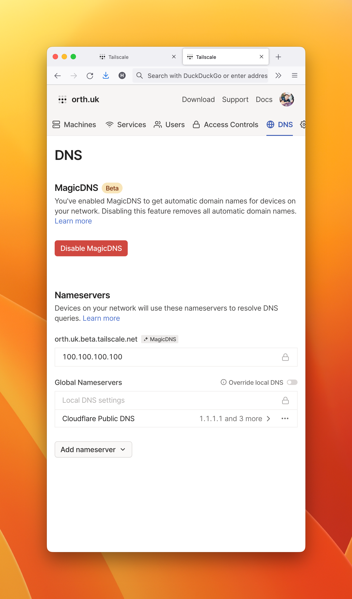
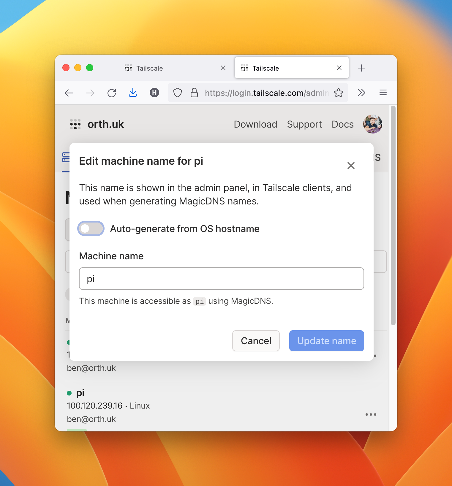

# Replacing Cloudflare Tunnels with Tailscale SSH

I wrote [SSH into your private machines from anywhere, for free, using Cloudflare Tunnel](/ssh-over-cloudflare) in April which led to a lot of discussion on [Hacker News](https://news.ycombinator.com/item?id=30283987). A lot of people started mentioning alternatives (Tailscale, ZeroTier and issues with Cloudflare).

<!--truncate-->

> If you like this, you’re gonna love Tailscale https://tailscale.com/ - ***[mmettler](https://news.ycombinator.com/item?id=30284777)***

Tailscale has a beta product, [Tailscale SSH](https://tailscale.com/tailscale-ssh/) with 2 significant differences:

- **Easier setup:** Tailscale SSH is easy to configure (I don't really need to write the setup steps).
- **Less security**: Cloudflare Tunnels didn't replace authentication, but Tailscale SSH does. This means Tailscale could SSH (and access files) into my machine if they wanted to, but Cloudflare can't. With Cloudflare, I still had to authenticate with my private key.

## Steps 🛼

- [Install tailscale](https://tailscale.com/downloads) on client machine (e.g. macOS) and login
- [Install tailscale](https://tailscale.com/download/linux) on SSH server (e.g. raspberry pi)
- On SSH server, set up Tailscale to use SSH: `sudo tailscale up --ssh`
- Get the IP address of the SSH server machine from client machine or Tailscale website
- SSH into the machine:
  - `ssh username@$IP_ADDRESS`
  - If you have **Cloudflare WARP**: You need to **disable** it, because that prevented me connecting to my local machines using Tailscale - even though I could still use e.g. `ssh zen@raspberrypi.local -i ~/.ssh/raspberrypi` though.
- **Optional:** shorten SSH command into `ssh pi`
  - On Tailscale's [DNS admin page](https://login.tailscale.com/admin/dns), 
    - select a global nameserver and 
    - enable MagicDNS 

    
  - To SSH into your machine using fewer keystrokes, e.g. `ssh pi`, go into Tailscale's [Machines admin page](https://login.tailscale.com/admin/machines), and "edit machine name". Disable "auto-generate from OS hostname" and set the machine name.

## Benefits 🤙

- No machine passwords or SSH keys needed. Everything is replaced by your Tailscale account or SSO. I can move between laptops by just installing and logging into Tailscale.
- No SSH configuration needed (e.g. `~/.ssh/config` and `/etc/ssh/sshd_config`)
- The configuration is so easy, that we can save time and avoid frustration at work. I work at a company with quite a few test devices, and each new person or test device would mean more configuration/setup time. We can:
  - see a list of available test devices on the Tailscale website, 
  - setup developer machines to access these devices using SSO, and
  - setup new test devices with 2 commands (install and launch Tailscale).
  - We would do all of that whilst avoiding the poor experience with using VPNs and password managers.

## Conclusion 🏁

Overall, I think I'm going to stick to Tailscale instead of Cloudflare Tunnels for accessing machines on my home network when away.

**Question:** what would you do? 😇