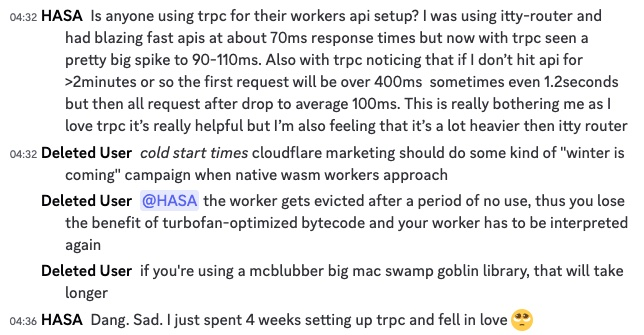

# tRPC + Astro + Cloudflare Workers
I haven't seen if [Astro](https://astro.build/), [tRPC](https://trpc.io/) and [Cloudflare Workers](https://workers.cloudflare.com/) go well together. I found myself asking: must tRPC be in a separate package/deployment (e.g. `packages/` in a monorepo, or separate Cloudflare Worker). I'm pleased to say it's relatively straight forward - there are a few options.
<!--truncate-->

***Update:*** I last updated this page on 2nd April 2023, as I use tRPC in my job, and Astro in my free time.

## Background:
If you haven't heard of Cloudflare Workers, tRPC or Astro, read this. Otherwise, skip to [options](#options).
- **Cloudflare Workers:** cheap but fast serverless platform that integrates Cloudflare's other services: SQLite on the edge (D1), S3-alternative with zero egress fees (R2) and WebSockets (durable objects, also used by [DriftDB](https://news.ycombinator.com/item?id=34639728)).
- **tRPC** lets you *call your backend like you call functions*. It's similar to gRPC, but without the code generation headache that comes with it. When using gRPC/protobufs, I've found the codegen to be a very complex area:
  - There are multiple code generation tools for each language, with different features and bugs. They're not consistent. Not all features are implemented for each language.
  - gRPC/protobuf code generation tools seem to be neglected.
  - Code generation can be configured in different ways. This means the generated code is different and incompatible. Switching codegen tools to get their features (e.g. `google-protobuf/grpc-web` to `protobuf-ts`, or in Python: from `betterproto` to `grpcio_tools`) are major breaking changes. 
  - *Warning:* Should tRPC even be used in Cloudflare Workers? It might have cold-start issues.



- I don't have these issues, and another discord user mentioned: 
> Cold starts definitely play a part but it just sounds like the codes own initialisation
- **Astro** is a framework for developing web applications with any Javascript/Typescript framework. You can make static or server-side rendered (SSG) websites. You can write code that executes in the browser and in your backend, in the same file (when using SSG). It's like NextJS but it supports React, Svelte, Vue, Solid and more, in the same app (and UI component).

```typescript
---
import Layout from "../layouts/Layout.astro";
import { trpcClient } from "../ts/trpcClient";

// Server-side: Call rest of backend APIs, e.g. createUser
const userId = await trpcClient.createUser.mutate({
	name: "benbutterworth",
	bio: "gardener",
});
const user = await trpcClient.getUserById.query(userId);
// Logged server-side (in cloudflare)
console.log({ user });
---

<Layout title="Welcome to Astro.">
	<main>
    <p>Generated server-side</p>
		<h1>Welcome, {user.name}</h1>
		<h2>User ID: {userId}</h2>
		<h2>User bio: {user.bio}</h2>
		<p>Generated client-side</p>
		<h1 class="user2"></h1>
		<h2 class="user2-id"></h2>
		<h2 class="user2-bio"></h2>
	</main>
	<script>
		// Client-side: Call backend APIs, e.g. createUser
		import { trpcClient } from "../ts/trpcClient";

		const userId = await trpcClient.createUser.mutate({
			name: "Anonymous",
			bio: "Interwebs",
		});
		const user = await trpcClient.getUserById.query(userId)
		// Logged client-side (browser console).
		console.log({ user });

		document.querySelector("h1.user2")!.textContent = `Hello, ${user.name}`;
		document.querySelector("h2.user2-id")!.textContent = userId;
		document.querySelector("h2.user2-bio")!.textContent = user.bio;
	</script>
</Layout>
```
- **Zapp.run**: is a cool online Flutter IDE that makes use of Cloudflare Workers and Astro, and judging by [ Astro + tRPC v10](https://invertase.io/blog/astro-trpc-v10/), perhaps they use tRPC as well.

## Options:

- Simplest option: Avoid tRPC completely
- Simpler option: Cloudflare Pages
- Complex option: Cloudflare Pages + Cloudflare Worker

### Simplest option: Avoid tRPC completely

*In practice, this isn't really an option.*

Astro already supports server-side rendering. You can run code server-side above `---` in your [components](https://docs.astro.build/en/core-concepts/astro-components/#component-structure). You can already use your environment variables securely, and connect directly to private APIs/databases. You can already call end-to-end typesafe APIs, because each Astro page can be rendered server side.

However, Astro doesn't give you a way to call your APIs *from the browser* in a typesafe way, *after the page loads*.

### Simpler option: Cloudflare Pages

- Both the backend code (tRPC, database access, R2 access) lives in the same "package" as the frontend.
- Example 
  - website: https://trpc-astro-cloudflare.pages.dev/
  - repo: https://github.com/ben-xD/trpc-astro-cloudflare
- Positives:
  - Less configuration and code
  - Simpler deployment. Your server-side code in `.astro` files run on the same service.
  - Single command to deploy
  - Hot-restart works well. Saving a file leads to the backend rebuilding, and the frontend refreshing. In the example, run `pnpm dev` to start the dev server.
- Negatives:
  - Larger bundle size. Your frontend and backend application (or part of it) is in the same cloudflare pages project.
- Deployed using Cloudflare Pages: `wrangler pages publish` (internally uses Cloudflare Workers)
- **Separation of concerns:** You can call other Cloudflare Workers from your Cloudflare Pages Function using ["Cloudflare Pages Functions Service Bindings"](https://developers.cloudflare.com/pages/platform/functions/bindings/#service-bindings). This does not incur network latency because tRPC running on Cloudflare Workers uses the fetch API, which does not go over the network.

### Complex option: Cloudflare Pages + Backend
- This is approach is probably good if you've already got a backend. This backend can be Cloudflare Workers running tRPC, Hono, Express, any combination of these, or anything else (e.g. NodeJS). Consider tRPC's [Express.js adapter](https://trpc.io/docs/express) or [Hono adapter](https://www.npmjs.com/package/@hono/trpc-server) ([discussion](https://github.com/honojs/hono/issues/582)). This allows you to avoid Cloudflare Worker platform for server-side rendering.
- Positives:
  - Deploy frontend and backend separately. Choose different services for frontend and backend.
  - Separation: the code will not get entangled, because they're in separate packages. Forces you to be more strict.
  - Cloudflare Workers separate from frontend: Cloudflare Pages (which uses Workers internally)
    - This separation means they are separate workers:
      - more control over worker / features
- Negatives:
    - More complex maintenance. e.g. You need to setup monorepo tool to build backend code before frontend is built. When deploying a preview environment, you need to deploy the backend. The frontend needs to be pointed to the correct backend. Preview environments are not self-contained.
- Deployed as 1 Cloudflare Pages deployment, and 1 Cloudflare worker: `wrangler publish`
- **Separation of concerns:** You can call other Cloudflare Workers using **Service Bindings**. This also does not incur network latency because tRPC running on Cloudflare Workers uses the fetch API, which does not go over the network.

## Summary 📒
I'm currently trying **tRPC with Astro, on Cloudflare Pages**, without using service bindings. Let me know if you have any questions.

## Other resources
- [tRPC Pages Plugin](https://github.com/toyamarinyon/cloudflare-pages-plugin-trpc): for both options, you can use this plugin for some convenience (to get Cloudflare bindings to D1, R2, etc.).
- Warning: When calling another worker (service bindings), you need to use the Cloudflare API, which means you lose type safety. tRPC does have [server-side calls](https://trpc.io/docs/server/server-side-calls), however that will call the same worker: it does not allow you to call other workers with different implementations. This means your worker would get large, and you lose "separation of concerns" between multiple workers.
- Warning: Even though Jetbrain's Webstorm IDE has an Astro plugin, it looks like it doesn't support tRPC. For example, you cannot navigate to the implementation of a query/mutation (`getUserById: t.procedure.input(z.string())...`) from the astro file (`const user = await client.getUserById.query(userId);`).
