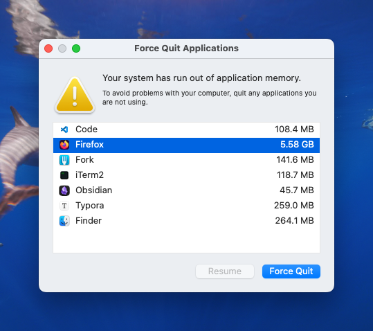

# Running SeamlessM4T locally for translating text and speech on M1 macs

I found a YouTube video spoken in french, and I wanted to translate it to English. This was an opportunity to try SeamlessM4T. However, when I tried to use it, it ended up taking more than an hour. After finding the path of least resistance that actually worked, I wanted to share this with others.

<!--truncate-->

These steps are for the terminal. I used an ARM mac (M1 Pro). Intel macs are a bit more complicated because some dependencies need to be manually built locally (`fairseq2`).

SeamlessM4T is a family of models that can translate:
- text to speech
- speech to text
- text to text
- speech to speech (my use case today, translating French videos into English)

## Set up SeamlessM4T locally

- Use Python 3.11, because 3.12 is not supported by torch or fairseq2
    - I already use pyenv, so I'll run: `pyenv local 3.11`
    - You can install it too, but a simpler option is to uninstall python and download and install version 3.11 from https://www.python.org/downloads/
- Clone the [repo](https://github.com/facebookresearch/seamless_communication): `git clone git@github.com:facebookresearch/seamless_communication.git`
- Change directory: `cd seamless_communication`
- `python -m venv venv`
- `source venv/bin/activate`
- `pip install torch fairseq2 -r dev_requirements.txt`
- `pip install -e .`
    - this downloads dependencies from pyproject.toml and makes the current directory an editable package
- `brew install libsndfile`
    - When running `m4t_predict` later, if you get an error `OSError: libsndfile is not found! Use your system package manager to install it `, reinstall it by running `brew reinstall libsndfile`

## my extra step (for YouTube)

- Download the YouTube video, using [yt-dlp](https://github.com/yt-dlp/yt-dlp)
- Convert the video into wav, using [ffmpeg](https://ffmpeg.org/), I ran `ffmpeg -i path/to/video.webm path/to/output-video.wav`
- Run it through seamless (in my case I'm running the speech to speech task - s2st): 
```bash
m4t_predict --task s2st --model_name seamlessM4T_medium --tgt_lang eng 'path/to/input.wav' --output_path output`date +%Y-%m-%d.%H:%M:%S`.wav
```

## **Lag/crash warning** 

When running the default model (SeamlessM4T-Large v2) on my MacBook Pro with 16GB memory and M1 pro chip, it started lagging for a few minutes, "your system has run out of application memory" constantly popped up, and then my computer froze. *Now, I use the SeamlessM4T-Medium model, and it works.*



## ValueError: The input sequence length must be less than or equal to the maximum sequence length (4096), but is 11800 instead.

If this happens, your input audio is too long. You can manually split the a few clips, depending on how many words are spoken. I'll be writing a python script to split the audio clip into chunks of 4096 max, and then run seamless on each chunk, and merge the audio back together.

A quick test is to just trim the input audio to 60 seconds chunks with ffmpeg, run `ffmpeg - i input.wav -t 60 output-60s-1.wav` for the first clip, then start at 60s and end at 60s `ffmpeg - i input.wav -ss 60 -t 60 output-60s-2.wav`, and so on.

## To delete the downloaded models

The v2 large model (`seamlessM4T_v2_large.pt`) is 8.4GB. You might not have enough space to keep all models locally.

On macOS, models are stored in your home folder: /$HOME/.cache/fairseq2/assets, for example, `/Users/yourusername/.cache/fairseq2/assets`. Open it in finder and delete files you don't want: `open $HOME/.cache/fairseq2/assets` and delete them.

## More resources

- docs: https://github.com/facebookresearch/seamless_communication/tree/main/docs/m4t
- Seamless Tutorial: https://github.com/facebookresearch/seamless_communication/blob/main/Seamless_Tutorial.ipynb
- Languages supported: https://github.com/facebookresearch/seamless_communication/blob/main/docs/m4t/README.md#supported-languages