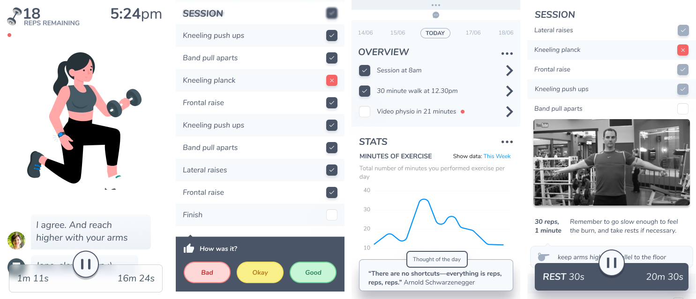
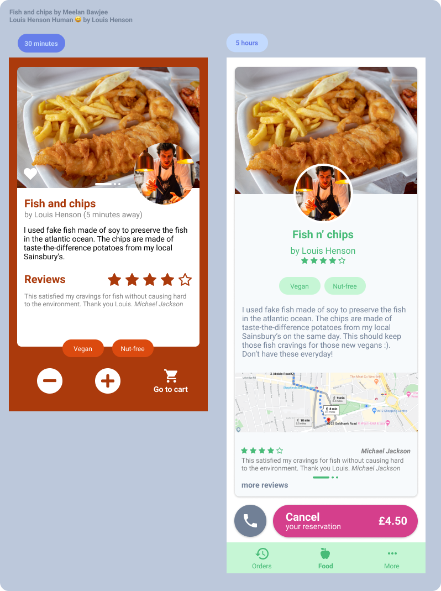
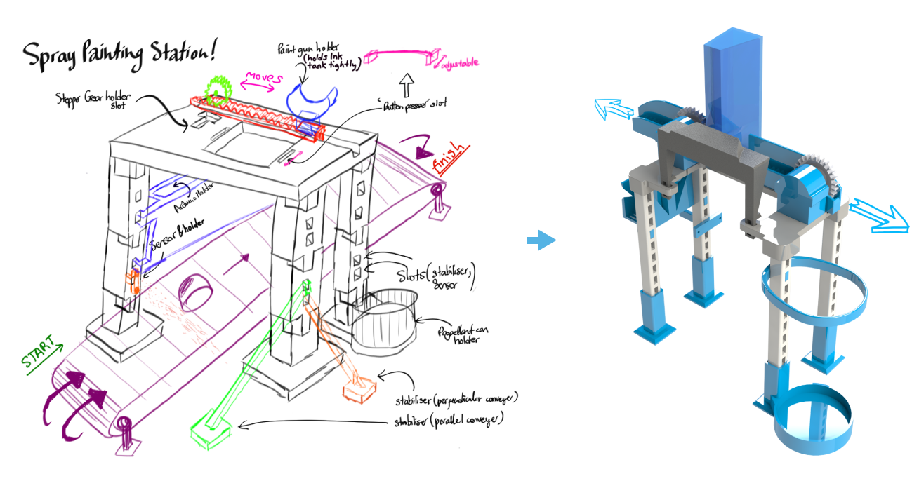
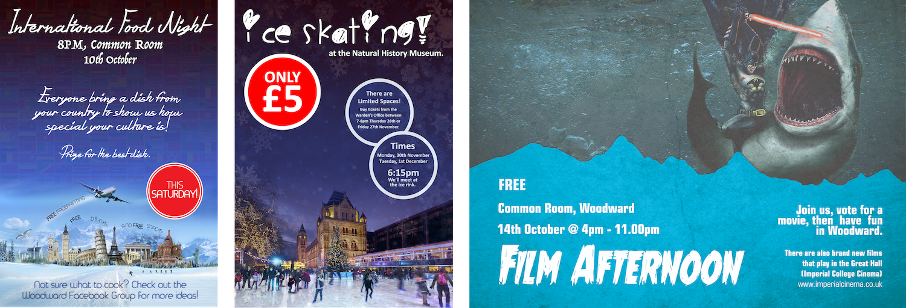
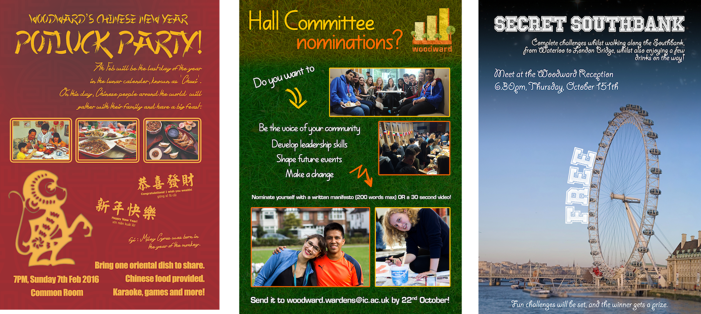
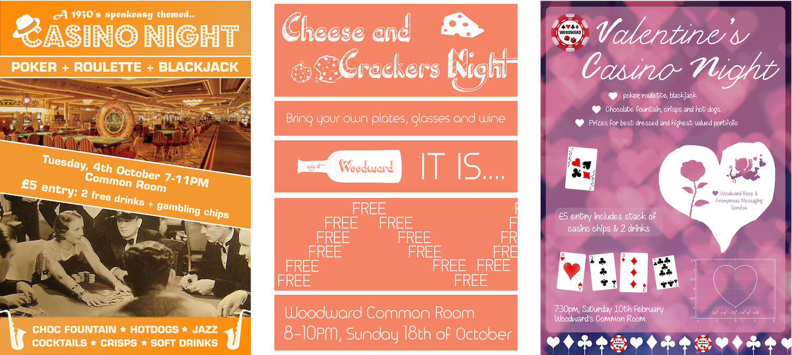

## Overview

Here's what I use:
- **Favourite resources:** time, documentation, open source projects - other peoples code 😈, getting-started guides, OReilly books, WWDC, Hacker News, YouTube
- **Learning style:** building projects, transitioning to books and videos when lack of knowledge slows me down enough.

> Choose the "hard way", or "the way that seems easy but leads nowhere". ([Scott H. Young](https://www.scotthyoung.com/blog/2020/06/01/effort-vs-effectiveness/))

## [Push](https://pub.dev/packages/push), a Flutter package for push notifications

**Push** is a flutter package designed to handle push notifications - including background notification, alert notifications and notification taps. Users can avoid using Firebase on all platforms except Android - for example, on iOS, they can use APNs directly.

  <iframe
    width='600'
    height='337'
    src='https://www.youtube-nocookie.com/embed/wZ45n9-hjEc'
    frameborder='0'
    allow='accelerometer; autoplay; encrypted-media; gyroscope; picture-in-picture'
    allowfullscreen
  ></iframe>

## [Club2D](https://club2d.orth.uk), an anonymous video calling app using machine learning

A blog post about this is [here](/club2d). Club2D is an anonymous video calling app inspired by the Memoji feature available on FaceTime, and allows emotions and face gestures to be shared with others without revealing someone's identity, background, disability or ethnicity. You should try building random projects which interest you because it will help you learn a lot faster than reading books or watching tutorials. Before this project, I did not know how to do 3D rendering (three.js), machine learning in the browser (MediaPipe/ TensorFlowJS), static site generation (NextJS), realtime/ event driven behaviour (Ably), nice CSS styling (TailwindCSS), and only knew a bit of ReactJS, CSS, Cloudflare and Firebase. I'm quite proud of what I made, and was delighted to see many my colleagues impressed by it as well. You can try it at [Club2D.orth.uk](https://call.orth.uk). In doing this, I managed to ask and answer questions on StackOverflow, and am also proud to see my reputation reach 6.1k.

## A physiotherapy app

When building an app, it's important you think about the user experience to make sure you build something useful and spend your time wisely. Here are 4 example screens I designed over a few hours using [Figma](https://www.figma.com/). 

## Cheffresh

Cheffresh is a Flutter app made during the 48 hour [Flutter International Hackathon 2020](https://flutterhackathon.com/), with 2500+ participants. ([GitHub](https://github.com/FreshOver/cheffresh))

  <iframe
    width='600'
    height='337'
    src='https://www.youtube-nocookie.com/embed/zl8voaFNOcE'
    frameborder='0'
    allow='accelerometer; autoplay; encrypted-media; gyroscope; picture-in-picture'
    allowfullscreen
  ></iframe>

First, I started with sketching the UI on paper. Then, when designing the UI digitally in Figma, I kept in mind the tips from the [Refactoring UI](https://refactoringui.com/) book. Then I coded it up in VSCode, Dart and Flutter, together with my [team](https://github.com/FreshOver).

(Fish and chip image by [Meelan Bawjee](https://unsplash.com/photos/A_tPBct4tz8) and Louis Henson (chef) by [Louis Henson](https://unsplash.com/photos/v3OlBE6-fhU)).

## Beam'd

A physiotherapy app which uses 3D pose estimation on both Android and iOS devices. I am still working on this, but the UI I designed using Figma can be found [here](https://www.figma.com/file/nMyBdvEhOt1VUaLg2k93iR/Beam-d?node-id=0%3A1).

## DeepTex

- An unreleased Flutter application which uses Tensorflow Lite and deep learning to classify LaTex characters that the user draws on the screen. You might wonder, "where do I have the dataset of hand-drawn LaTex characters?". The answer is, I don't, and am making the mobile app to allow users to draw the characters based on a provided character, to crowdsource the dataset. This project is still in development.

## [Foodprint](https://foodprint.orth.uk/)

Foodprint is a mobile app that calculates the carbon footprint of food from a picture or receipt.

- [iOS](https://apps.apple.com/us/app/foodprint/id1510153419?ls=1) and [Android](https://play.google.com/store/apps/details?id=uk.orth.foodprint) app: I learnt React Native over Christmas and published an app. I used React Native, NodeJS, GraphQL and Firebase. This involves meeting strict Apple Store guidelines and not-so-strict Play Store policies. I used CodePush to deploy code changes without going through another app review process.
- [Landing page](https://foodprint.orth.uk), a progressive-web-app (PWA) built using React & [Gatsby](https://www.gatsbyjs.org/). Built in 5 hours. I also use Gatsby for this blog.

### What I would do different in a future app:

- User testing/ research: ensure people would actually find value in the app. Build features they want
- User analytics/ logging: track user actions and crashes.
- Use Flutter: Animations in React Native is more difficult, and its bridge architecture limits certain types of applications.
- Use Firebase to its potential: Firebase has a lot of functionality and I'm keen on using them to provide cool features to new users. These features include Dynamic links, MLKit/ machine learning, hosting.
- More tests?: Learning to test is definitely learning a new form of programming. We had 60% test coverage on the mobile app, because UI's are harder to test. I'll reserve full test coverage for apps that need long term maintainability though.

## Reimbursr

[Reimbursr](https://github.com/LeBoucEtMistere/ICHack20) is a React Native mobile app that allows you to get instantly reimbursed by your company for expenses. You take a picture of your receipt, and the value of the receipt is automatically added to your bank balance using ThoughtMachine's banking APIs and Computer vision. Above a certain dollar/ currency amount, you need approval from a manager to get the refund. We used NodeJS, NestJS, React Native and Python (for computer vision and related logic). The application used secret (NDA) code by [Thought Machine](http://thoughtmachine.net/) that we aren't allowed to share, so unfortunately you can't try this app. ThoughtMachine invited us to demo in front of their whole company (~100 people) and have some food there too. I was also given "the hard thing about hard things" by Ben Horowitz, the exploding kittens game, among other things.

## CalendarMD

First, I wrote javascript code to programmatically delete hundreds of calendar events I accidentally added to the wrong Calendar. Google ~Calendar doesn't let you undo adding events, or delete many events at once. I wrote a script to search through all events in a calendar and delete them. Then, I _met_ React Native at a meetup in London. Because React Native apps are written in JavaScript, I could re-use the code in a mobile application, and release it to Android Play Store. Voila, my [first application](https://play.google.com/store/apps/details?id=co.fresla.bed).

## LeonHack

A weekend of [Leon](https://leon.co/) 🍔 Food and WebSockets 🔌. We built a IoT solution which counts the number of food items on the 'hot path', the area between the kitchen and the front of the shop. Food on the hot path needs to be thrown away if not sold within a certain time. I built a webapp, and connected it to a backend to update the UI instantaneously, when food is taken or added to the hot path. I spoke with and presented to the Leon Team, including the Founder. This allows Leon kitchens to be more efficient, cooking more when food is needed, instead of waiting for the frontline staff to verbally communicate with them. Personally, I had too much Leon vegan burgers in one weekend, and started feeling a little sick. They taste good once in a while though 🥄.

## Parking and driving mobile app

This app allows you to get driving navigation reminders to nearby parking lots based on events on your Google Calendar. I worked on the JavaScript code related to Google Maps and Google Calendar API, and worked with 2 experienced engineers who knew Ionic, the cross platform mobile framework.

## Terraform & Clouds (AWS, GCP, Managed Hosting)

I was curious what infrastructure as code (IAC) was. So I used Terraform to deploy Cloudflare DNS records (email/ MX, A, etc), EC2 instances for AWS with the correct network configuration. This means I can deploy and destroy the configuration whenever I want, without having to remember or write down the configuration I used before. Highly recommended! I evaluated terraform, AWS and self-hosting as an alternative to managed-hosting (GoDaddy) for a website with 3000+ unique visitors each day. In the end, we stayed with managed-hosting, but moved their website to a different provider, HostGator.

## Career website web scraper

A python application to filter companies with rating > 4★ on Glassdoor. My python app scraped all the companies on the website, browsing through different pages, and making a list/ array of company names. Then, it would query Glassdoor and webscrape that too, showing only the companies that have a rating of more than 4. I write this in 2018, after realising many companies at some careers fair were hiring because they had very high turnover, and a very low glassdoor rating, suggesting their team had left them for better avenues 🤔. Should I be putting this here?

### Issues I faced:

- Glassdoor does not have an API, and I had to webscrape the website. I had to pick the first company in the search results for the company name, and sometimes these search results were wrong.

## Automatic painting machine

- For a university project in 2017, I did some basic Arduino programming, and used an Arduino, infrared sensors, stepper motors and 3D printed parts I designed myself. One of the first few concept sketches on the left led to a later design on the right. Thinking back, it was kind of an overcomplicated design, but I liked how it worked and the organising [professor](https://www.imperial.ac.uk/people/l.vandeperre) said he was impressed 😃.

.

## Event posters

At university, I made posters using Photoshop (and sometimes Illustrator). Here are some:

