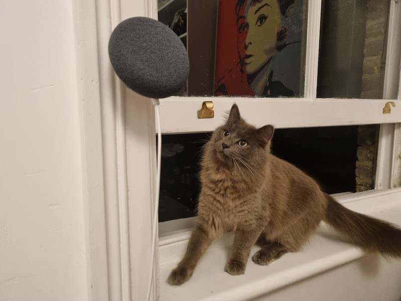

# 🌶 Warning 🦑

This document is still in progress. Come back on February 28th, 2022. The 2 hour workshop will take place on March 26, 2022. 
Whilst you wait, look at this cat observing my google nest mini.

# Workshop: Building a multiplayer drawing game

Come build a multiplayer drawing game using Flutter, and learn things about Flutter, Firebase, releasing apps, CI/CD, testing and most importantly, "realtime" functionality.

## Why read this document

- Prepare your machine and your mind before the day
- Follow along at your own pace
- After the workshop, continue where you left off
- You prefer reading text than watching videos or people

## Features

TODO

## Workshop outline

TODO

## Pre-requisites

TODO

## Workshop walkthough

TODO

## Conclusion

TODO