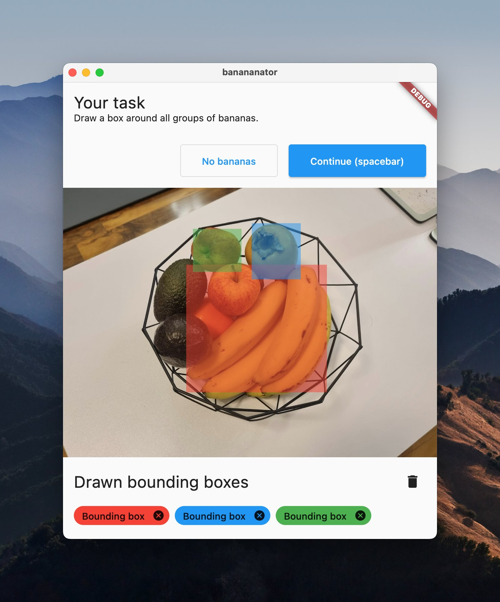
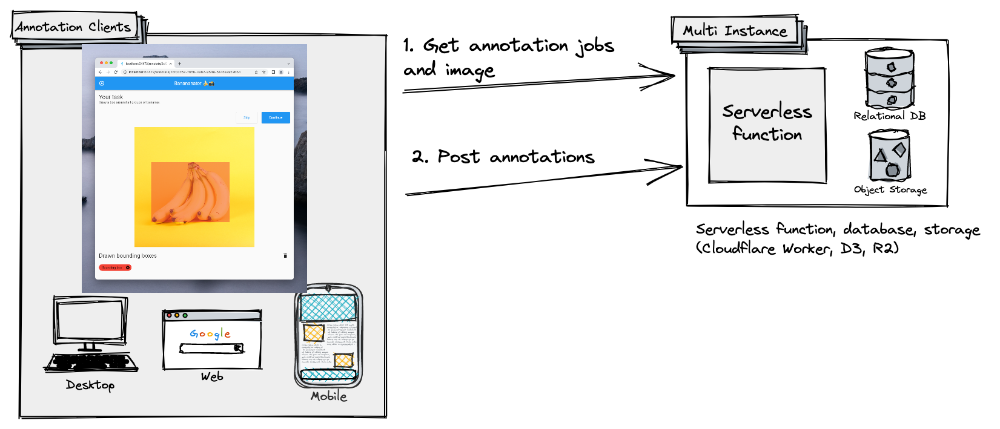
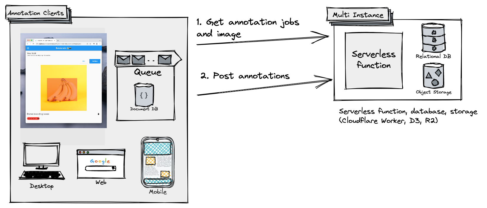

### Adding offline support to Flutter Apps
- 1hr workshop
- Slides: [link.orth.uk/gdg22](https://link.orth.uk/gdg22)
- [GitHub repo](https://github.com/ben-xD/bounding_box_annotation_flutter)
<!-- - Codelab: [link.orth.uk/gdg22-lab](https://link.orth.uk/gdg22-lab) -->
- by [Ben Butterworth](https://orth.uk)

--h

## Offline?

--h

--h
 **Principle:** *Think about offline at the start. Offline is a feature that affects all other features, **not an implementation detail**.*
- **Opportunity:** No one talks about this, because no one really monetises this space.
Note:
- A startup builds an *image and video annotation* service.
- Users are paid to open our app to annotate pictures.
- This is where the a startup founder would talk about the market of bananas.
- Our MVP is aimed at detecting bananas in images.
- Describe the 2 APIs required: get annotation jobs, and submit annotations.
- REMINDER: Walkthrough the app as a real user.

--h
### Fragile version

- Web: https://banananator-fragile.pages.dev/

--h
### Offline-capable version

- Web: https://banananator.pages.dev/

--h
## Challenges 💪

- network disconnection or airplane mode
- Connected but no network
- Avoiding heavy downloads over Cellular?
- Engagement when offline? Analytics?

--h
## Reality

- Offline was a very low priority when the app was created.

--h
## Case studies

- YouTube whilst offline (add screenshot)
    - I can watch the video, but I can't comment?
    - Maybe because the timestamp is server generated
- Figma whilst offline (add screenshot)

--h
## Technical 🧠

- "We are provided an HTTP API we can use to listen get annotation jobs, and submit annotations."
- Suggested improvement to system diagram

--h
### System diagram 🔌

--h
### System diagram (after) 🥳

--h
### Existing solutions
- [Many](https://stackoverflow.com/questions/49648022/check-whether-there-is-an-internet-connection-available-on-flutter-app) Stack Overflow answers
- [connectivity_plus](https://pub.dev/packages/connectivity_plus)
    - On web, uses [experimental APIs](https://pub.dev/packages/connectivity_plus#limitations-on-the-web-platform), not widely supported:
        - [`NetworkInformation`](https://developer.mozilla.org/en-US/docs/Web/API/NetworkInformation) and falls back to `navigator.onLine` (LAN connection)
        - Or consider [`Navigator.connection`](https://developer.mozilla.org/en-US/docs/Web/API/Navigator/connection)
    - LAN connection on Android
- [`internet_connection_checker`](https://pub.dev/packages/internet_connection_checker#how-it-works) - doesn't support web.

--h
### More solutions
- [`retry`](https://pub.dev/packages/retry): simple: just retries, but what if the app was restarted?

--h
### Services
- Firebase Cloud [Firestore](https://pub.dev/packages/cloud_firestore) ([docs](https://firebase.flutter.dev/docs/database/offline-capabilities/))
- Realm by MongoDB has "[Device Sync](https://www.mongodb.com/atlas/app-services/device-sync)"

--h
### Advanced solutions

- OT: Google docs, Figma
- CRDTs?
    - [`package:crdt`](https://pub.dev/packages/crdt)
    - Doesn't work well in practice because of low performance and low correctness.
        - Notes: there is no user interaction, the conflicts are resolved automatically, and **not always correctly**.
    - Very early. Many crdt examples [often show text insertion and deletion](https://writer.zohopublic.com/writer/published/grcwy5c699d67b9c444219b60cdb90ccbabc7), but not rich text functionality like bold, italic, font sizes or lists and tables. See [Peritext](https://www.inkandswitch.com/peritext/).
> Apps that need to run offline in general are good candidates for CRDTs. - [Paul Butler](https://driftingin.space/posts/you-might-not-need-a-crdt)
    - TODO embed [tweet](https://twitter.com/drifting_corp/status/1599777237707853826?ref_src=twsrc%5Etfw%7Ctwcamp%5Etweetembed%7Ctwterm%5E1599777237707853826%7Ctwgr%5E195ff5a9f5d5918b61da7ab302626420ef95c685%7Ctwcon%5Es1_&ref_url=https%3A%2F%2Fdriftingin.space%2Fposts%2Fyou-might-not-need-a-crdt)

--h
### My solution

- On web, just make a get request. Image server has `cache-control max-age` to allow browsers to cache
- On desktop and mobile, download to a local file

--h
## Live interaction time 👀

### Time to 
- add features
- discuss things
- answer questions or 
- solve problems

--h 
## by Ben Butterworth
- Fill out your feedback: [orth.uk/feedback](https://orth.uk/feedback)
- Software Engineer at [**Helsing**](https://helsing.ai/).  Interesting technical problems, with opportunity to help the world.
- LinkedIn: https://www.linkedin.com/in/bbutterworth/
- Recent app published: Dirr